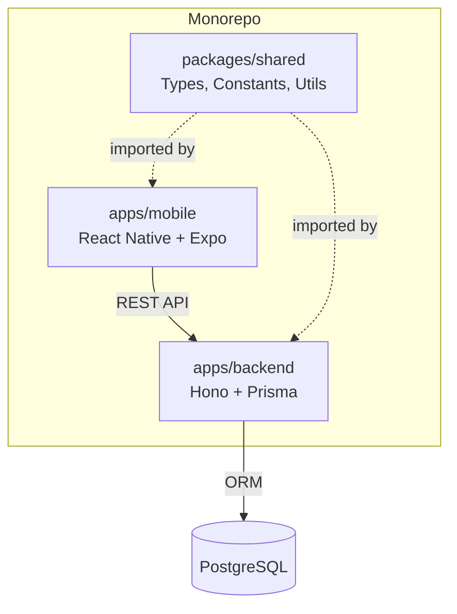

# Did You Do Your Dailies? (DYDYD)

**Turn daily habits into a game worth playing.**

[](https://github.com/edmundtrinh/DYDYD/actions/workflows/ci.yml)
[](LICENSE)
[](CONTRIBUTING.md)

<!-- TODO: Add hero screenshot or demo GIF -->

## Vision

DYDYD replaces the phone homescreen with an all-in-one habit and routine builder. Instead of guilt-driven streak mechanics, it uses positive reinforcement -- XP, levels, badges, and quests -- to help scatter-brained, procrastination-prone people become their best selves, one day at a time.

The app meets you where you are. Miss a day? Earn a Comeback Quest with bonus XP. Feeling overwhelmed? Start with one two-minute habit. DYDYD is built on the belief that consistency grows from encouragement, not punishment.

## Features

### Gamification Engine

- 30+ predefined quests across 5 life categories
- Exponential XP growth with 100 level titles
- 20+ earnable badges with rarity tiers
- Daily, weekly, and monthly quest frequencies
- Streak tracking with compassionate design (streak freezes, comeback quests)

### Health Integration

- Apple HealthKit, Google Fit, Garmin, and Samsung Health
- Quests can link to a health data source for tracking
- Backend sync for cross-device health data

### Mobile Experience

- 19 screens with full navigation (auth, onboarding, main tabs)
- Haptic feedback on key interactions
- Quest completion celebrations and badge earned modals
- Level up overlays with animations
- Quest search and filtering
- Streak calendar with progress visualization

### Backend Services

- JWT authentication with access and refresh tokens (15m / 7d)
- 8 REST API route groups (auth, quests, user, progress, health, badges, notifications, system health)
- Rate limiting (100 req/15min)
- 11-model Prisma schema covering users, quests, completions, badges, notifications, devices

### Production Readiness

- Push notifications via Expo
- Offline support with sync queue
- Sentry error monitoring
- Account deletion flow
- Privacy policy and terms of service
- EAS Build for cloud-based iOS and Android builds

## Architecture



The `packages/shared` package is the single source of truth for domain types (`User`, `Quest`, `Badge`, etc.), business constants (quest library, badge definitions, level titles), and utility functions (XP calculations, streak logic, validation). Both apps import from `@dydyd/shared` -- domain types are never redefined locally.

## Tech Stack

| Layer | Technology |
|-------|-----------|
| Mobile Framework | React Native 0.79 + TypeScript |
| Mobile Build | Expo 53 + EAS Build (cloud CI for iOS and Android) |
| State Management | Redux Toolkit + Redux Persist |
| Navigation | React Navigation 7 |
| Backend Framework | Hono 4 |
| Backend Runtime | Bun (primary) / Node.js (fallback) |
| Validation | Zod + @hono/zod-validator |
| Database | PostgreSQL + Prisma ORM |
| Authentication | JWT (access + refresh tokens) |
| Health Data | Apple HealthKit, Google Fit, Garmin, Samsung Health |
| Push Notifications | Expo Notifications |
| Error Monitoring | Sentry |
| Monorepo | Yarn Workspaces + Turborepo |
| CI/CD | GitHub Actions + EAS Build |
| Language | TypeScript strict mode (all workspaces) |

## Getting Started

### Prerequisites

- Bun 1.2+ (primary backend runtime) or Node.js 22+ (fallback)
- Yarn 4 (via Corepack)
- PostgreSQL (local or Docker)
- Xcode 15+ (iOS development, macOS only)
- Android Studio (Android development)

### Installation

1. **Enable Corepack** (if not already):
   ```bash
   corepack enable
   ```

2. **Clone and install**:
   ```bash
   git clone https://github.com/edmundtrinh/DYDYD.git
   cd DYDYD
   yarn install
   ```

3. **Build the shared package** (required before backend or mobile can use it):
   ```bash
   yarn shared build
   ```

4. **Set up the backend environment**:
   ```bash
   cp apps/backend/.env.example apps/backend/.env
   ```
   Then edit `apps/backend/.env` and configure:
   - `DATABASE_URL` -- your PostgreSQL connection string
   - `JWT_SECRET` -- secret for access token signing
   - `JWT_REFRESH_SECRET` -- secret for refresh token signing

5. **Run database migrations**:
   ```bash
   yarn workspace @dydyd/backend db:migrate
   ```

6. **Start development servers**:
   ```bash
   # Terminal 1: Backend with hot reload
   yarn start:backend

   # Terminal 2: Metro bundler for React Native
   yarn start:mobile
   ```

### Building for Devices

DYDYD uses EAS Build for cloud-based builds -- iOS builds work from any OS, including Windows.

```bash
# From apps/mobile/
eas build --profile development --platform all    # Dev client builds
eas build --profile preview --platform ios        # iOS IPA (internal distribution)
eas build --profile production --platform all     # Store-ready builds
```

See the [EAS Build documentation](https://docs.expo.dev/build/introduction/) for account setup and configuration.

## Project Structure

```
DYDYD/
├── apps/
│   ├── backend/                 # Hono API server (Bun runtime)
│   │   ├── prisma/              #   Prisma schema and migrations
│   │   └── src/
│   │       ├── middleware/      #   Auth, rate limiting, error handling
│   │       ├── routes/          #   8 route groups
│   │       ├── lib/             #   Prisma client, streak logic
│   │       └── __tests__/       #   Jest + supertest route tests
│   └── mobile/                  # React Native app
│       └── src/
│           ├── screens/         #   19 screens
│           ├── components/      #   14 reusable components
│           ├── store/           #   Redux slices (7) + store config
│           ├── services/        #   API client, health integrations
│           ├── navigation/      #   Auth, onboarding, main tab navigators
│           └── theme/           #   Design tokens, typography
├── packages/
│   └── shared/                  # Shared TypeScript package
│       └── src/
│           ├── types.ts         #   All domain interfaces and enums
│           ├── constants.ts     #   Quest library, badges, level titles, XP config
│           └── utils.ts         #   XP calculations, streak logic, validation
├── specs/                       # Product specs, roadmap, decision records
├── turbo.json                   # Turborepo pipeline configuration
└── package.json                 # Monorepo root (Yarn Workspaces)
```

## Testing

```bash
yarn test:all                                      # All workspaces
yarn workspace @dydyd/backend test                 # Backend (166+ tests, 7 suites)
yarn workspace @dydyd/shared test                  # Shared (120 tests)
yarn lint:all                                      # Lint all workspaces
```

Backend tests use Hono's native `app.request()` -- no HTTP server required, faster test execution than supertest.

CI runs tests, linting, TypeScript strict-mode typechecking, and Prisma schema validation on every push and pull request.

## Quest Categories

| Category | Examples |
|----------|----------|
| Physical Health | Steps, sleep, exercise, hydration |
| Mental Wellness | Meditation, journaling, reading |
| Career & Productivity | Job applications, learning, networking |
| Relationships & Social | Family time, social outings, phone calls |
| Home & Chores | Cleaning, laundry, cooking, groceries |

## Roadmap

DYDYD is in **Phase 4A: The Vision**. iOS widgets have shipped (PR #82), compassionate streak design is implementation-complete and rebasing for merge, and the Apple Watch companion is next (Issue #81). The backend has been modernized from Express/Node.js to Hono/Bun (PR #88). This phase represents the core product thesis: the app should live on your homescreen and your wrist, not buried in a folder.

For the full roadmap including completed phases and future plans, see [specs/roadmap.md](specs/roadmap.md).

<!-- TODO: Add screenshots of quest completion, badge earned, and streak calendar -->

## Contributing

Contributions are welcome. See [CONTRIBUTING.md](CONTRIBUTING.md) for guidelines on how to get started, coding standards, and the pull request process.

## License

This project is licensed under the MIT License. See [LICENSE](LICENSE) for details.
