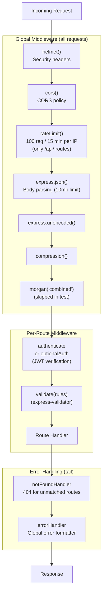
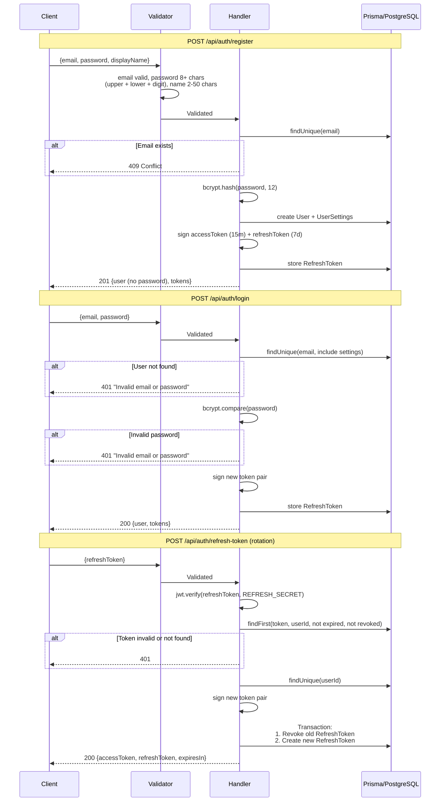
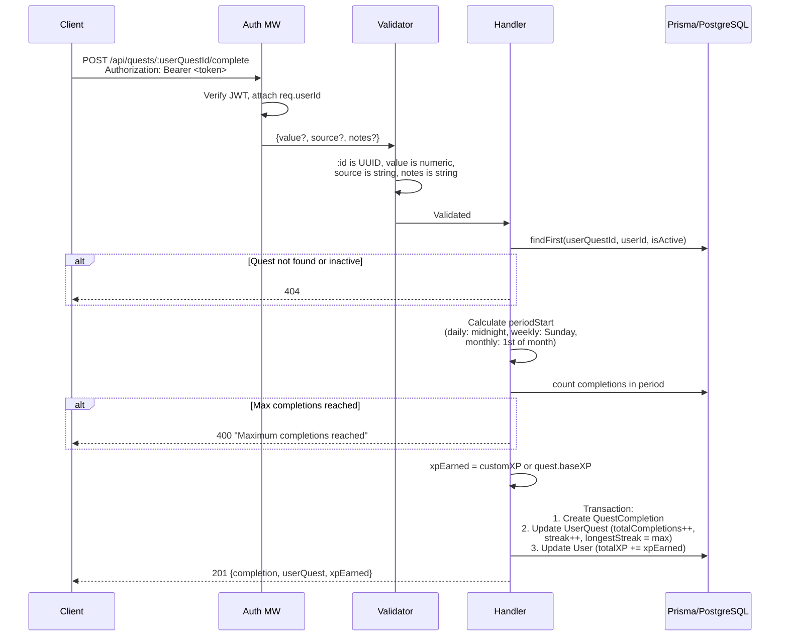
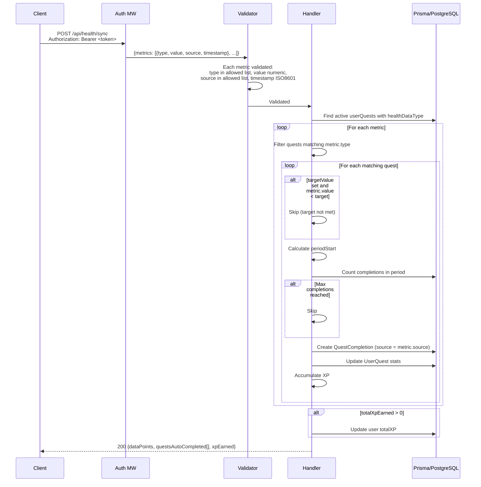
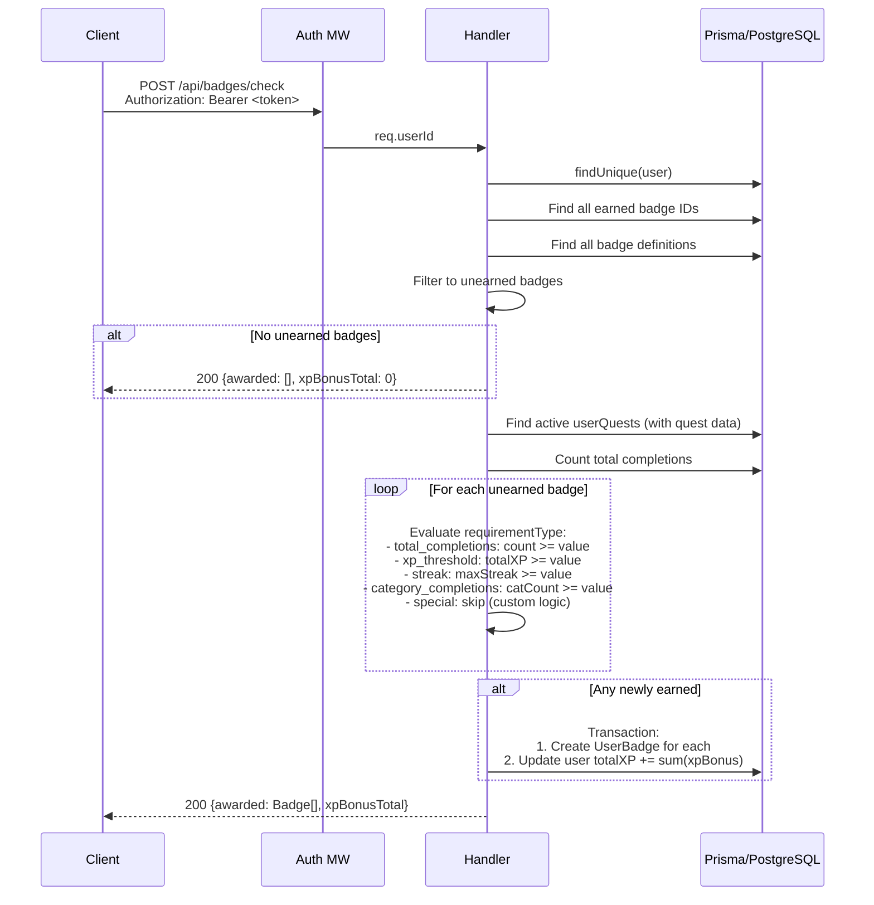

# Backend API Architecture

## Table of Contents

- [Overview](#overview)
- [Middleware Pipeline](#middleware-pipeline)
- [Route Summary](#route-summary)
- [Sequence Diagrams](#sequence-diagrams)
  - [Auth: Register, Login, Refresh](#auth-register-login-refresh)
  - [Quest Completion](#quest-completion)
  - [Health Sync (Auto-Complete)](#health-sync-auto-complete)
  - [Badge Check and Award](#badge-check-and-award)
- [Error Handling Strategy](#error-handling-strategy)
- [Response Envelope](#response-envelope)
- [Validation Patterns](#validation-patterns)

## Overview

The DYDYD backend is an **Express 4** REST API written in TypeScript. It uses **Prisma ORM** for PostgreSQL access and **JWT** for authentication. The server is defined in `apps/backend/src/index.ts` and listens on port 3000 by default.

The API serves 7 route groups mounted under `/api/` plus a health check endpoint at `/health`.

## Middleware Pipeline

Requests pass through middleware in a specific order. Some middleware is global (applied to all requests), while route-level middleware is applied per-endpoint.



### Global Middleware Details

| Middleware | Purpose |
|---|---|
| `helmet()` | Sets security-related HTTP headers (X-Content-Type-Options, X-Frame-Options, etc.) |
| `cors()` | Configures CORS. Origin from `CORS_ORIGIN` env var, defaults to `*`. Credentials enabled. |
| `rateLimit()` | 100 requests per 15-minute window per IP. Applied to `/api/` prefix only. Returns JSON error message. |
| `express.json()` | Parses JSON request bodies. 10MB limit. |
| `express.urlencoded()` | Parses URL-encoded bodies. |
| `compression()` | Gzip/deflate response compression. |
| `morgan('combined')` | HTTP request logging. Disabled when `NODE_ENV=test`. |

### Per-Route Middleware

| Middleware | Purpose |
|---|---|
| `authenticate` | Extracts Bearer token from Authorization header, verifies JWT, attaches `req.userId` and `req.user`. Throws 401 on failure. |
| `optionalAuth` | Same as `authenticate` but does not throw if token is missing or invalid. Used for public endpoints that optionally personalize. |
| `validate(rules)` | Runs `express-validator` validation chains. Collects errors into `{ field: string[] }` format. Throws 422 on failure. |

## Route Summary

| Method | Path | Auth | Description |
|---|---|---|---|
| `GET` | `/health` | None | Health check (status, timestamp, environment) |
| **Auth** | | | |
| `POST` | `/api/auth/register` | None | Register new user |
| `POST` | `/api/auth/login` | None | Login with email/password |
| `POST` | `/api/auth/refresh-token` | None | Rotate refresh token |
| `POST` | `/api/auth/logout` | Required | Revoke refresh token(s) |
| `POST` | `/api/auth/forgot-password` | None | Generate password reset token |
| `POST` | `/api/auth/reset-password` | None | Reset password with token |
| **Quests** | | | |
| `GET` | `/api/quests/library` | Optional | List predefined quests |
| `GET` | `/api/quests/user` | Required | List user's active quests |
| `POST` | `/api/quests/activate` | Required | Activate a quest |
| `POST` | `/api/quests/:id/complete` | Required | Complete a quest (`:id` is userQuest ID) |
| `DELETE` | `/api/quests/:id` | Required | Deactivate a quest (`:id` is userQuest ID) |
| `POST` | `/api/quests/custom` | Required | Create a custom quest |
| **User** | | | |
| `GET` | `/api/user/profile` | Required | Get user profile |
| `PUT` | `/api/user/profile` | Required | Update profile |
| `GET` | `/api/user/settings` | Required | Get user settings |
| `PUT` | `/api/user/settings` | Required | Update settings |
| `GET` | `/api/user/category-priorities` | Required | Get category priorities |
| `PUT` | `/api/user/category-priorities` | Required | Update category priorities |
| `DELETE` | `/api/user/account` | Required | Delete account (requires password) |
| **Progress** | | | |
| `GET` | `/api/progress/stats` | Required | Overall user statistics |
| `GET` | `/api/progress/daily` | Required | Daily progress (optional `?date=`) |
| `GET` | `/api/progress/weekly` | Required | Weekly progress (optional `?weekStart=`) |
| `GET` | `/api/progress/badges` | Required | User's earned badges |
| `GET` | `/api/progress/leaderboard` | Required | Leaderboard (`?type=weekly\|all-time&limit=`) |
| **Badges** | | | |
| `GET` | `/api/badges` | Optional | List all badge definitions |
| `GET` | `/api/badges/user` | Required | List user's earned badges |
| `POST` | `/api/badges/check` | Required | Evaluate and award new badges |
| **Notifications** | | | |
| `POST` | `/api/notifications/device-token` | Required | Register device push token |
| `GET` | `/api/notifications` | Required | Notification history (paginated) |
| `PUT` | `/api/notifications/:id/read` | Required | Mark notification as read |
| **Health** | | | |
| `POST` | `/api/health/sync` | Required | Sync health metrics, auto-complete quests |

## Sequence Diagrams

### Auth: Register, Login, Refresh



### Quest Completion



### Health Sync (Auto-Complete)



### Badge Check and Award



## Error Handling Strategy

The error handling system uses a custom `AppError` class and a centralized `errorHandler` middleware.

### AppError Class

```
AppError {
  message: string
  statusCode: number    // HTTP status code
  code: string          // Machine-readable error code
  details?: object      // Additional context (validation errors, etc.)
}
```

### Error Factory Functions

| Factory | Status | Code |
|---|---|---|
| `Errors.badRequest(msg)` | 400 | `BAD_REQUEST` |
| `Errors.unauthorized(msg)` | 401 | `UNAUTHORIZED` |
| `Errors.forbidden(msg)` | 403 | `FORBIDDEN` |
| `Errors.notFound(resource)` | 404 | `NOT_FOUND` |
| `Errors.conflict(msg)` | 409 | `CONFLICT` |
| `Errors.validationError(details)` | 422 | `VALIDATION_ERROR` |
| `Errors.tooManyRequests(msg)` | 429 | `TOO_MANY_REQUESTS` |
| `Errors.internal(msg)` | 500 | `INTERNAL_ERROR` |

### Error Handler Behavior

The global `errorHandler` middleware processes errors in this priority order:

1. **`AppError` instances** -- Return the error's status code, code, message, and details.
2. **`ValidationError`** (from express-validator) -- Return 422 with validation details.
3. **`JsonWebTokenError`** -- Return 401 with `INVALID_TOKEN` code.
4. **`TokenExpiredError`** -- Return 401 with `TOKEN_EXPIRED` code.
5. **All other errors** -- Return 500. In production, the message is generic ("Internal server error"). In development, the original error message is returned.

Errors are logged to console in development mode only.

### 404 Handler

The `notFoundHandler` middleware is registered after all route handlers. It catches any request that did not match a route and throws `Errors.notFound('Endpoint')`, which the error handler formats as a 404 response.

## Response Envelope

All API responses use a consistent envelope format defined by the `ApiResponse<T>` type from `@dydyd/shared`:

### Success Response

```json
{
  "success": true,
  "data": { ... },
  "meta": {                    // optional, used for pagination
    "page": 1,
    "perPage": 20,
    "total": 150,
    "hasMore": true
  }
}
```

### Error Response

```json
{
  "success": false,
  "error": {
    "code": "VALIDATION_ERROR",
    "message": "Validation failed",
    "details": {
      "email": ["Please provide a valid email"],
      "password": ["Password must be at least 8 characters"]
    }
  }
}
```

## Validation Patterns

Validation uses `express-validator` with a custom `validate()` middleware factory. Validation rules are defined as arrays of `ValidationChain` objects colocated with each route.

### Password Requirements

- Minimum 8 characters
- Must contain at least one uppercase letter, one lowercase letter, and one digit
- Regex: `/^(?=.*[a-z])(?=.*[A-Z])(?=.*\d)/`

### UUID Parameters

All `:id` path parameters are validated with `.isUUID()`. The backend uses UUID v4 for all primary keys.

### Pagination

The notifications endpoint supports pagination via query parameters:

- `page` -- Page number (default: 1, minimum: 1)
- `perPage` -- Items per page (default: 20, minimum: 1, maximum: 100)
- Response includes `meta.hasMore` boolean for client-side "load more" logic.

### Leaderboard Parameters

- `type` -- `weekly` or `all-time` (default: `weekly`)
- `limit` -- Number of entries (default: 10, minimum: 1, maximum: 100)
