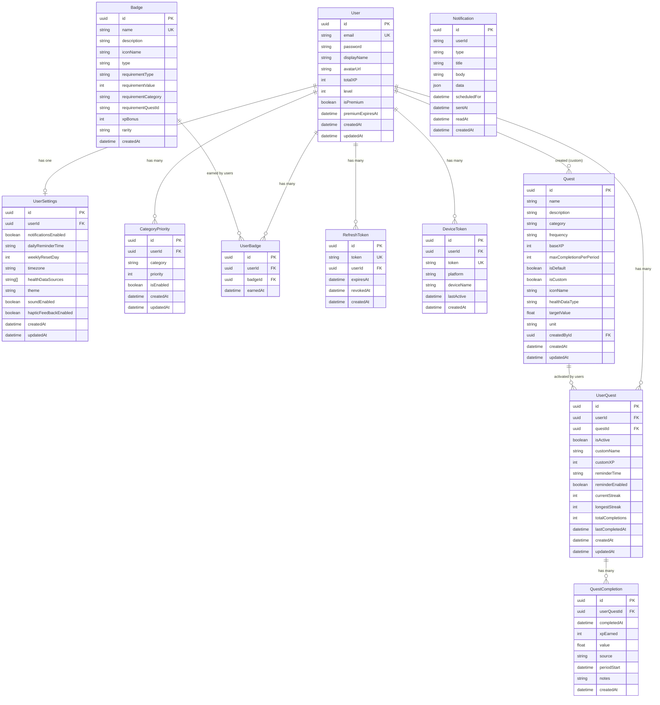

# Data Model

## Table of Contents

- [Overview](#overview)
- [Entity Relationship Diagram](#entity-relationship-diagram)
- [Model Descriptions](#model-descriptions)
- [Constraints and Indexes](#constraints-and-indexes)
- [Cascade Behavior](#cascade-behavior)
- [Planned Additions](#planned-additions)

## Overview

The DYDYD database consists of **11 Prisma models** backed by PostgreSQL. The schema is defined in `apps/backend/prisma/schema.prisma` and managed via `prisma migrate` (not `db push`). The baseline migration lives at `prisma/migrations/20260618000000_init`.

## Entity Relationship Diagram

> Note: `Notification` has a `userId` column but no Prisma `@relation` to `User` -- it is not cascade-deleted via FK. The account deletion handler explicitly deletes notifications in its transaction.

## Model Descriptions

### User

Central identity model. Stores authentication credentials, profile information, and gamification progress (totalXP, level). The `isPremium` flag controls custom quest limits (3 free, 50 premium).

### UserSettings

One-to-one with User. Stores all user preferences: notification toggles, daily reminder time (HH:mm), weekly reset day (0=Sunday through 6=Saturday), timezone, theme (light/dark/system), sound, and haptic feedback. `healthDataSources` is a PostgreSQL text array storing which health platforms the user has connected.

### CategoryPriority

Per-user ranking of the 5 quest categories. `priority` ranges from 1--5, `isEnabled` controls whether the category is shown. Unique constraint on `[userId, category]` prevents duplicates.

### Quest

Defines a quest template. Can be a predefined default (`isDefault: true`) seeded from `PREDEFINED_QUESTS` in the shared package, or a user-created custom quest (`isCustom: true`, linked via `createdById`). `healthDataType` and `targetValue` enable automatic completion from health sync data (e.g., 10000 steps).

### UserQuest

Join table between User and Quest with per-user state: activation status, optional custom name/XP overrides, reminder settings, and streak tracking. `currentStreak` is incremented on completion; `longestStreak` is the historical max. Unique constraint on `[userId, questId]` ensures a user cannot activate the same quest twice.

### QuestCompletion

Individual completion records. `periodStart` anchors the completion to its day/week/month boundary for enforcing `maxCompletionsPerPeriod`. `source` tracks whether the completion was manual or from a health integration (`apple_health`, `google_fit`, `garmin`, `samsung_health`).

### Badge

Defines badge templates with requirement rules. `requirementType` can be `total_completions`, `xp_threshold`, `streak`, `category_completions`, or `special`. `rarity` tiers: `common`, `rare`, `epic`, `legendary`. `xpBonus` is awarded when the badge is earned.

### UserBadge

Join table between User and Badge. `earnedAt` records when the badge was awarded. Unique constraint on `[userId, badgeId]` prevents duplicate awards.

### RefreshToken

Stores JWT refresh tokens with expiry and revocation tracking. Also reused for password reset tokens (prefixed with `password_reset:` and storing the SHA-256 hash). `revokedAt` is set on logout or token rotation.

### DeviceToken

Push notification device tokens. `platform` values: `ios`, `android`, `watchos`, `wear_os`, `tizen`, `garmin`. Upserted on registration -- if the same `token` string is re-registered, the record is updated rather than duplicated.

### Notification

Server-side notification records. Currently write-only from the backend perspective (no send endpoint). Supports scheduled notifications (`scheduledFor`) and read tracking (`readAt`). `data` is a JSON column for arbitrary notification payload.

## Constraints and Indexes

### Unique Constraints

| Model | Constraint | Column(s) |
|---|---|---|
| User | `@unique` | `email` |
| UserSettings | `@unique` | `userId` |
| Badge | `@unique` | `name` |
| RefreshToken | `@unique` | `token` |
| DeviceToken | `@unique` | `token` |
| CategoryPriority | `@@unique` | `[userId, category]` |
| UserQuest | `@@unique` | `[userId, questId]` |
| UserBadge | `@@unique` | `[userId, badgeId]` |

### Primary Keys

All models use `@id @default(uuid())` for their primary key.

### Table Mapping

All models use `@@map` to PostgreSQL snake_case table names (e.g., `User` maps to `users`, `UserQuest` maps to `user_quests`).

### Explicit Indexes

The current schema defines no explicit `@@index` directives. PostgreSQL automatically creates indexes for primary keys and unique constraints. Composite unique constraints (`@@unique`) also produce composite indexes.

## Cascade Behavior

| Relation | onDelete |
|---|---|
| UserSettings -> User | `Cascade` |
| CategoryPriority -> User | `Cascade` |
| UserQuest -> User | `Cascade` |
| UserQuest -> Quest | `Cascade` |
| QuestCompletion -> UserQuest | `Cascade` |
| UserBadge -> User | `Cascade` |
| UserBadge -> Badge | `Cascade` |
| RefreshToken -> User | `Cascade` |
| DeviceToken -> User | `Cascade` |
| Quest -> User (createdBy) | `SetNull` |

When a User is deleted, all their settings, priorities, quests, badges, tokens, and device tokens are cascade-deleted. Custom quests created by a deleted user have their `createdById` set to null (the quest definition persists for other users who may have activated it).

> Note: The account deletion endpoint (`DELETE /api/user/account`) performs an explicit transaction deleting all related records in order, rather than relying solely on database cascades.

## Planned Additions

> **STATUS: PLANNED** -- These fields do not exist in the current schema.

### Compassionate Streaks

Two additions are planned to support "compassionate streaks" (streaks that forgive occasional misses):

- **`streakFreezes`** (on `UserQuest` or a new model): Tracks the number of "freeze" days a user has banked, allowing them to miss a day without breaking their streak.
- **`activeDaysCount`** (on `UserQuest`): Tracks total active days (days with at least one completion) to enable percentage-based streak logic instead of strict consecutive-day counting.

These changes will require a new Prisma migration and updates to the streak calculation logic in `apps/backend/src/lib/streaks.ts`.
