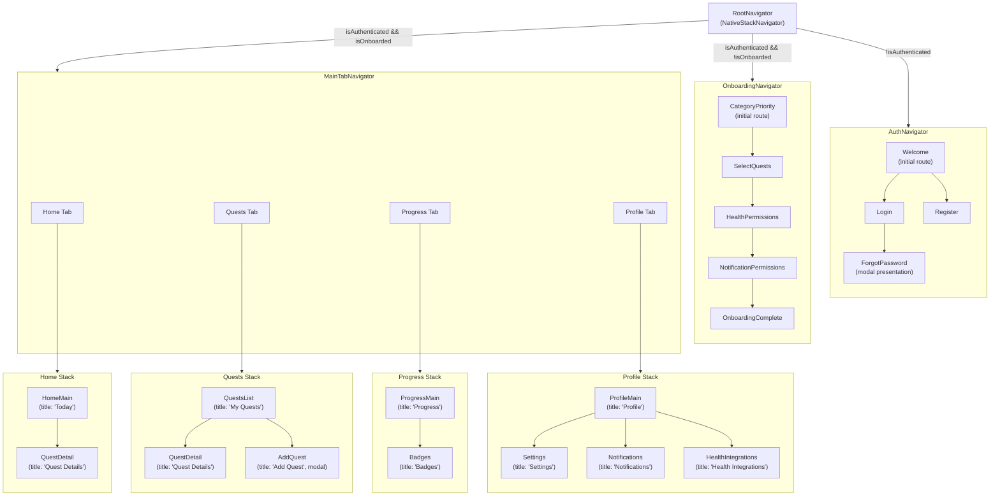

# Mobile App Navigation

## Table of Contents

- [Overview](#overview)
- [Navigation Tree](#navigation-tree)
- [Root Navigator](#root-navigator)
- [Auth Navigator](#auth-navigator)
- [Onboarding Navigator](#onboarding-navigator)
- [Main Tab Navigator](#main-tab-navigator)
- [Screen Inventory](#screen-inventory)
- [Global Overlays](#global-overlays)
- [Planned Screens (Typed but Not Wired)](#planned-screens-typed-but-not-wired)
- [Deep Linking](#deep-linking)

## Overview

Navigation is implemented with **React Navigation 6** using native stack navigators (`@react-navigation/native-stack`) and a bottom tab navigator (`@react-navigation/bottom-tabs`). The `RootNavigator` conditionally renders one of three sub-navigators based on Redux state:

- **Not authenticated** -> `AuthNavigator`
- **Authenticated but not onboarded** -> `OnboardingNavigator`
- **Authenticated and onboarded** -> `MainTabNavigator`

All navigation types and param lists are defined in the navigation files and exported from `apps/mobile/src/navigation/index.ts`.

## Navigation Tree

## Root Navigator

**File**: `apps/mobile/src/navigation/RootNavigator.tsx`

The root navigator reads two selectors from the Redux `auth` slice:

- `selectIsAuthenticated` -- whether the user has a valid auth token
- `selectIsOnboarded` -- whether the user has completed the onboarding flow

Based on these, it renders exactly one of three child navigators. This pattern uses React Navigation's conditional screen rendering (screens are not stacked; only one sub-navigator is mounted at a time).

The root navigator also renders two global overlay components outside the navigation stack:

- `ToastContainer` -- App-wide toast notifications
- `BadgeEarnedModal` -- Full-screen modal when a badge is earned

## Auth Navigator

**File**: `apps/mobile/src/navigation/AuthNavigator.tsx`

| Screen | Component | Notes |
|---|---|---|
| `Welcome` | `WelcomeScreen` | Initial route. Entry point with login/register options. |
| `Login` | `LoginScreen` | Email + password login form. |
| `Register` | `RegisterScreen` | Registration form (email, password, display name). |
| `ForgotPassword` | `ForgotPasswordScreen` | Modal presentation. Password reset flow. |

All screens use `headerShown: false` (custom headers or no header).

## Onboarding Navigator

**File**: `apps/mobile/src/navigation/OnboardingNavigator.tsx`

A linear flow with `slide_from_right` animation. The user progresses through each screen in sequence:

| Step | Screen | Component | Purpose |
|---|---|---|---|
| 1 | `CategoryPriority` | `CategoryPriorityScreen` | Rank the 5 quest categories by priority |
| 2 | `SelectQuests` | `SelectQuestsScreen` | Choose initial quests from the library |
| 3 | `HealthPermissions` | `HealthPermissionsScreen` | Request HealthKit / Google Fit permissions |
| 4 | `NotificationPermissions` | `NotificationPermissionsScreen` | Request push notification permissions |
| 5 | `OnboardingComplete` | `OnboardingCompleteScreen` | Summary and transition to main app |

## Main Tab Navigator

**File**: `apps/mobile/src/navigation/MainTabNavigator.tsx`

Four bottom tabs, each containing its own native stack navigator:

### Tab Bar Configuration

| Tab | Icon (Feather) | Stack Navigator |
|---|---|---|
| Home | `home` | `HomeStackNavigator` |
| Quests | `list` | `QuestsStackNavigator` |
| Progress | `bar-chart-2` | `ProgressStackNavigator` |
| Profile | `user` | `ProfileStackNavigator` |

Tab bar styling uses the app's theme colors (`colors.primary` for active, `colors.textSecondary` for inactive).

### Home Stack

| Screen | Component | Params | Notes |
|---|---|---|---|
| `HomeMain` | `HomeScreen` | none | Title: "Today". Daily quest overview. |
| `QuestDetail` | `QuestDetailScreen` | `{ questId: string }` | Quest detail view. |

### Quests Stack

| Screen | Component | Params | Notes |
|---|---|---|---|
| `QuestsList` | `QuestsScreen` | none | Title: "My Quests". List of active quests. |
| `QuestDetail` | `QuestDetailScreen` | `{ questId: string }` | Quest detail view. |
| `AddQuest` | `AddQuestScreen` | `{ category?: string }` | Modal presentation. Add from library or create custom. |

### Progress Stack

| Screen | Component | Params | Notes |
|---|---|---|---|
| `ProgressMain` | `ProgressScreen` | none | Title: "Progress". Stats and charts. |
| `Badges` | `BadgesScreen` | none | Title: "Badges". Badge collection view. |

### Profile Stack

| Screen | Component | Params | Notes |
|---|---|---|---|
| `ProfileMain` | `ProfileScreen` | none | Title: "Profile". User info, level, XP. |
| `Settings` | `SettingsScreen` | none | Title: "Settings". App preferences. |
| `Notifications` | `NotificationsScreen` | none | Title: "Notifications". Notification history. |
| `HealthIntegrations` | `HealthIntegrationsScreen` | none | Title: "Health Integrations". Connect health sources. |

## Screen Inventory

Total screen registrations: **20** (19 unique components; `QuestDetailScreen` is registered in both the Home and Quests stacks)

| Navigator | Count | Screens |
|---|---|---|
| Auth | 4 | Welcome, Login, Register, ForgotPassword |
| Onboarding | 5 | CategoryPriority, SelectQuests, HealthPermissions, NotificationPermissions, OnboardingComplete |
| Home Stack | 2 | HomeMain, QuestDetail |
| Quests Stack | 3 | QuestsList, QuestDetail, AddQuest |
| Progress Stack | 2 | ProgressMain, Badges |
| Profile Stack | 4 | ProfileMain, Settings, Notifications, HealthIntegrations |

## Global Overlays

These components are rendered by `RootNavigator` outside the navigation stack and are always available regardless of which screen is active:

- **`ToastContainer`** -- Displays transient toast messages (success, error, info)
- **`BadgeEarnedModal`** -- Full-screen celebration modal when a new badge is earned

## Planned Screens (Typed but Not Wired)

The following screens are defined in `*StackParamList` type definitions but do **not** have corresponding `<Stack.Screen>` registrations. They are typed in preparation for future implementation:

| Stack | Screen Name | Params | Status |
|---|---|---|---|
| Home | `QuickComplete` | `{ questId: string }` | Typed, not wired |
| Quests | `EditQuest` | `{ questId: string }` | Typed, not wired |
| Progress | `Leaderboard` | none | Typed, not wired |
| Progress | `DetailedStats` | `{ category?: string }` | Typed, not wired |
| Profile | `Premium` | none | Typed, not wired |
| Profile | `About` | none | Typed, not wired |

## Deep Linking

No deep linking is currently configured. The `RootNavigator` does not receive a `linking` prop, and no URL scheme or universal link configuration was found in the app configuration. Deep linking support would require:

1. Defining a `scheme` in `app.json` / `app.config.ts`
2. Creating a `linking` configuration object mapping URL paths to screen names
3. Passing the configuration to `NavigationContainer` in the app entry point
