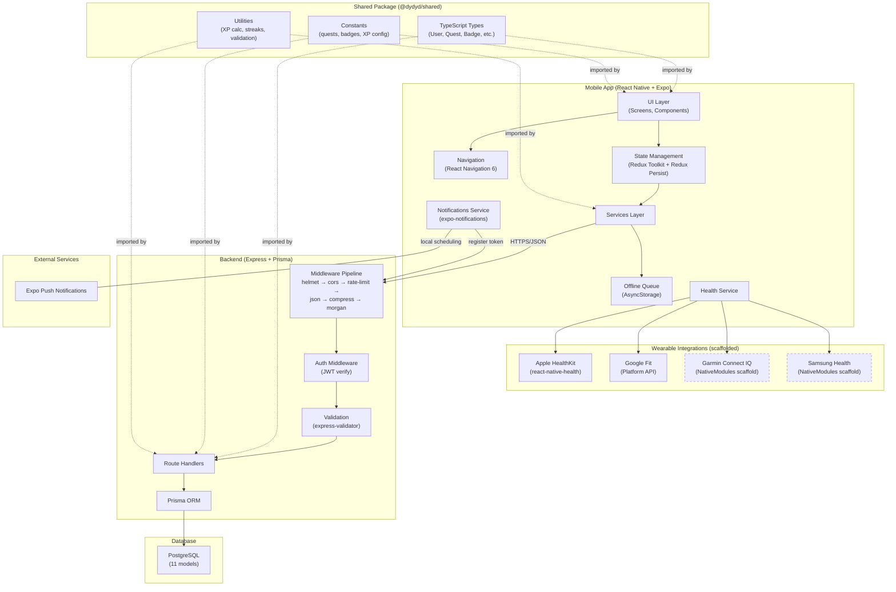
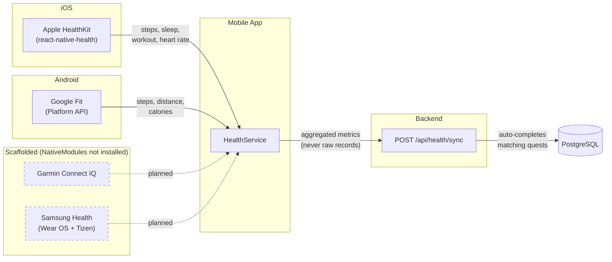
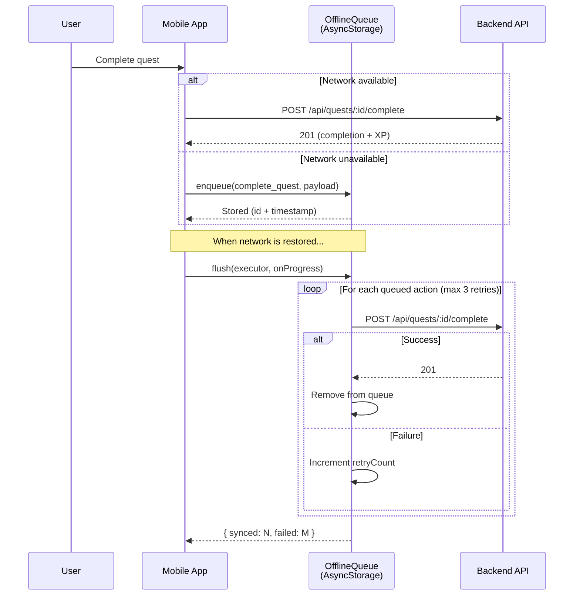
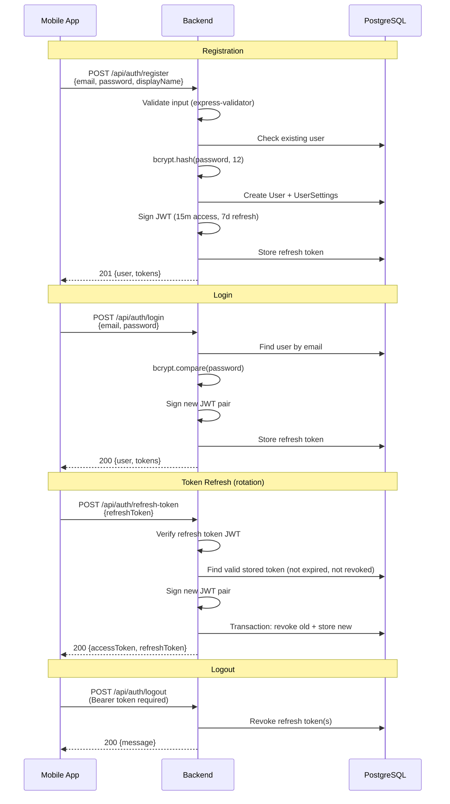
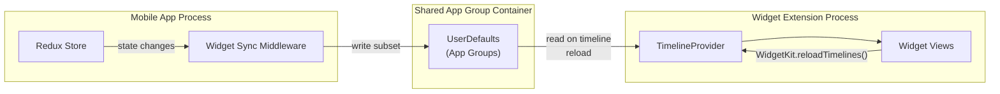
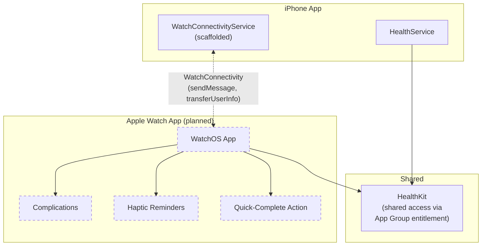

# System Architecture

## Table of Contents

- [Overview](#overview)
- [System Diagram](#system-diagram)
- [Layer Responsibilities](#layer-responsibilities)
- [Health Integrations](#health-integrations)
- [Push Notifications](#push-notifications)
- [Offline Sync](#offline-sync)
- [Authentication Flow](#authentication-flow)
- [Planned: iOS Widgets (Phase 4A)](#planned-ios-widgets-phase-4a)
- [Planned: Apple Watch (Phase 4A)](#planned-apple-watch-phase-4a)

## Overview

DYDYD is a gamified habit tracking application built as a **Yarn Workspaces + Turborepo monorepo** with three packages:

| Package | Path | Technology |
|---|---|---|
| Backend API | `apps/backend/` | Express 4, Prisma ORM, PostgreSQL |
| Mobile App | `apps/mobile/` | React Native 0.73, Expo, Redux Toolkit |
| Shared | `packages/shared/` | TypeScript types, constants, utilities |

## System Diagram

> Dashed borders indicate scaffolded services. Native modules are referenced in code but not yet installed or bridged.

## Layer Responsibilities

### Shared Package (`@dydyd/shared`)

The single source of truth for all domain types and business logic shared between backend and mobile.

- **`src/types.ts`** -- All TypeScript interfaces and enums: `User`, `Quest`, `Badge`, `HealthData`, `Progress`, `QuestCategory`, `QuestStatus`, etc.
- **`src/constants.ts`** -- 30+ predefined quests, 20+ badges, level titles (levels 1--100), XP configuration (base 100 XP, 1.15x exponential growth).
- **`src/utils.ts`** -- XP calculations, streak logic, date helpers, input validation, ID generation.

Must be built (`yarn shared build`) before backend or mobile can consume it. Turborepo pipelines enforce this ordering.

### Backend (`apps/backend/`)

Stateless REST API server. Responsibilities:

- **Authentication**: JWT-based. 15-minute access tokens, 7-day refresh tokens with rotation (old token revoked on refresh). Password reset via hashed tokens stored in the RefreshToken table with a `password_reset:` prefix.
- **Quest Management**: CRUD for user quests, quest completion with period-based limits (daily/weekly/monthly), automatic XP calculation, streak tracking.
- **Health Sync**: Accepts aggregated health metrics from the mobile app and auto-completes matching quests when target values are met. Raw health records are never sent to the server (Apple/Google data policy compliance).
- **Badge Evaluation**: Server-side badge check evaluates all unearned badges against current stats (total completions, XP thresholds, streaks, category completions) and awards in a single transaction.
- **Notifications**: Device token registration (upsert), notification history with pagination, mark-as-read. Note: the backend stores device tokens and notification records but does not currently have a send/dispatch endpoint -- push delivery is handled client-side via `expo-notifications`.
- **Rate Limiting**: 100 requests per 15-minute window per IP, applied globally to `/api/` routes.

### Mobile (`apps/mobile/`)

React Native application with Expo managed workflow. Responsibilities:

- **UI Rendering**: Screens and components for the full user journey (auth, onboarding, home, quests, progress, profile).
- **State Management**: Redux Toolkit with 7 slices (`auth`, `quests`, `progress`, `user`, `health`, `notifications`, `ui`). Persisted slices (`auth`, `user`, `quests`) use AsyncStorage via Redux Persist.
- **Offline Support**: `OfflineQueue` service persists actions (e.g., quest completions) to AsyncStorage when the network is unavailable. Queued actions flush with retry logic (max 3 retries) when connectivity is restored.
- **Health Data Collection**: Platform-specific health data aggregation (Apple HealthKit on iOS via `react-native-health`, Google Fit on Android). Summary metrics are sent to `POST /api/health/sync`.
- **Local Notifications**: Expo Notifications for quest reminders, scheduled locally on-device.

## Health Integrations

Supported health data types: `steps`, `distance`, `active_calories`, `sleep_hours`, `water_cups`, `workout_minutes`, `heart_rate`, `mindful_minutes`, `stand_hours`.

Supported sources: `apple_health`, `google_fit`, `garmin` (scaffolded), `samsung_health` (scaffolded), `manual`.

## Push Notifications

The notification system has two parts:

1. **Local scheduling** (implemented): The `NotificationsService` on mobile uses `expo-notifications` to schedule quest reminders locally. It requests permission, obtains an Expo push token, and registers it with the backend via `POST /api/notifications/device-token`.

2. **Server-side push** (not yet implemented): The backend stores device tokens and notification records but does not have a dispatch endpoint. There is no server-to-Expo push path wired up yet. The `Notification` model tracks `scheduledFor`, `sentAt`, and `readAt` timestamps in preparation for this.

## Offline Sync

## Authentication Flow

## Planned: iOS Widgets (Phase 4A)

> **STATUS: PLANNED** -- No implementation exists. This section describes the intended architecture.

**Planned widget types:**

| Size | Content | Data Needed |
|---|---|---|
| Small | Streak ring (current day streak) | `currentDayStreak`, `longestDayStreak` |
| Medium | Quest checklist (today's active quests) | Active `UserQuest[]` with completion status |
| Large | Dashboard (streak + XP + top quests) | Streak, level, XP, today's completions |

## Planned: Apple Watch (Phase 4A)

> **STATUS: PLANNED** -- The `WatchConnectivityService` is scaffolded (TypeScript interfaces and `NativeModules` references exist) but native modules are not installed or bridged.

**Planned watch message types** (defined in `WatchConnectivityService`):

- `SYNC_QUESTS` -- Send active quests to watch
- `QUEST_COMPLETED` -- Notify phone of watch-side completion
- `SYNC_PROGRESS` -- Send progress data to watch
- `REQUEST_SYNC` -- Watch requests fresh data
- `UPDATE_COMPLICATIONS` -- Trigger complication data refresh

**Planned watch features:**

- **Complications**: Streak count, XP progress ring, next quest due
- **Quick-Complete**: Tap to mark a quest done from the wrist
- **Haptic Reminders**: Gentle taps for quest reminders
- **HealthKit Shared Access**: Both iPhone and Watch read from the same HealthKit store via App Group entitlement
