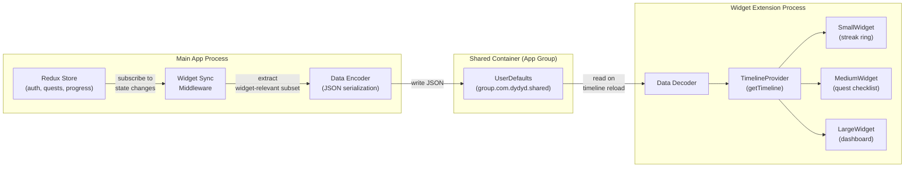
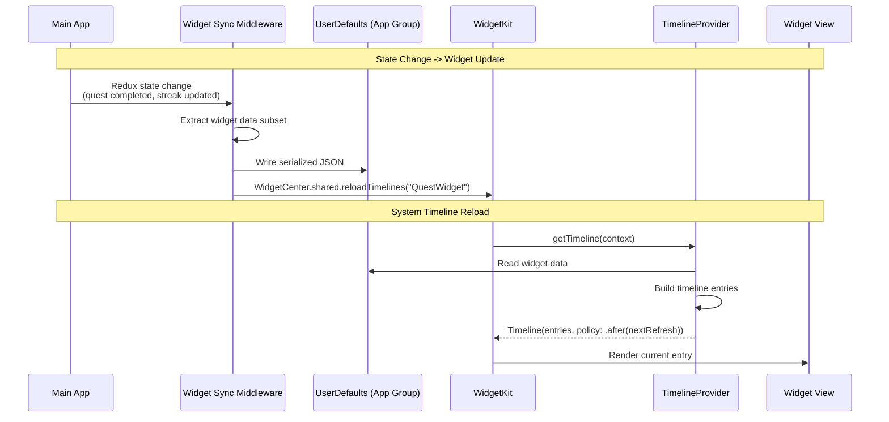
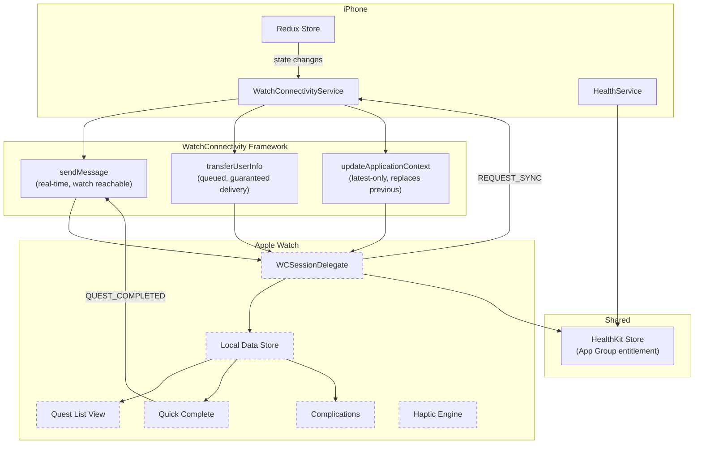
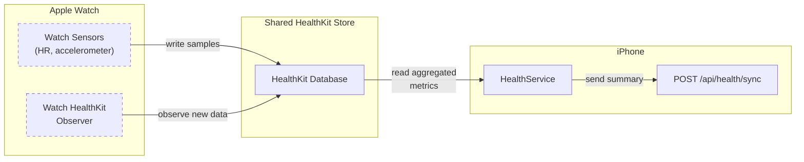

# Widget & Watch Architecture (Phase 4A)

> **STATUS: PLANNED** -- This document describes the architectural design for iOS widgets and Apple Watch support. No implementation exists beyond the scaffolded `WatchConnectivityService` in the mobile app.

## Table of Contents

- [Overview](#overview)
- [iOS Widget Architecture](#ios-widget-architecture)
  - [Data Flow](#widget-data-flow)
  - [Widget Types](#widget-types)
  - [Data Schema](#widget-data-schema)
  - [Refresh Strategy](#widget-refresh-strategy)
- [Apple Watch Architecture](#apple-watch-architecture)
  - [Communication Architecture](#communication-architecture)
  - [Watch Features](#watch-features)
  - [HealthKit Shared Access](#healthkit-shared-access)
  - [Existing Scaffolding](#existing-scaffolding)
- [Implementation Prerequisites](#implementation-prerequisites)

## Overview

Phase 4A introduces two native Apple platform extensions:

1. **iOS Widgets** (WidgetKit) -- Glanceable quest and streak information on the home screen and lock screen.
2. **Apple Watch App** (watchOS) -- Quick quest completion, complications, and haptic reminders from the wrist.

Both extensions operate in separate processes from the main app and require specific data-sharing mechanisms.

## iOS Widget Architecture

### Widget Data Flow

Widgets in iOS run in a separate process and cannot access the main app's memory. Data must be shared via **App Groups** using `UserDefaults` (for small, serializable data) or a shared SQLite container (for larger datasets).





### Widget Types

#### Small Widget -- Streak Ring

A circular progress indicator showing the current day streak.

| Data | Source |
|---|---|
| Current day streak | `progress.stats.currentDayStreak` |
| Longest day streak | `progress.stats.longestDayStreak` |
| Streak ring fill % | `current / target` (target configurable) |

**Visual**: Circular ring with streak count centered. Ring fills based on progress toward a personal streak goal.

#### Medium Widget -- Quest Checklist

Today's active quests with completion status.

| Data | Source |
|---|---|
| Active quest names | `userQuests[].quest.name` |
| Completion status | `userQuests[].completions` (today) |
| Quest icons | `userQuests[].quest.iconName` |
| Total completed / total | Computed from above |

**Visual**: Vertical list of 3-4 quests with check/uncheck indicators. Tapping a quest opens the app to that quest's detail screen.

#### Large Widget -- Dashboard

Combined view with streak, XP progress, and top quests.

| Data | Source |
|---|---|
| Streak ring | Same as small widget |
| Level + XP progress | `user.level`, `user.totalXP`, XP to next level |
| Today's top quests (3) | Subset of active quests sorted by priority |
| Category breakdown | Today's completions by category |

**Visual**: Streak ring in top-left, XP bar across the top, quest list below, category dots at the bottom.

### Widget Data Schema

The data written to `UserDefaults` should be a compact JSON object containing only what widgets need:

```
WidgetData {
  lastUpdated: ISO8601 string
  streak: {
    current: number
    longest: number
  }
  user: {
    level: number
    totalXP: number
    displayName: string
  }
  quests: [
    {
      id: string
      name: string
      iconName: string
      isCompletedToday: boolean
      category: string
    }
  ]  // max 5 quests, sorted by priority
  categoryBreakdown: {
    [category: string]: number  // completions today
  }
}
```

### Widget Refresh Strategy

| Trigger | Method |
|---|---|
| Quest completed | `WidgetCenter.shared.reloadTimelines()` from middleware |
| Streak updated | Same as above |
| App foregrounded | Middleware checks staleness, reloads if >5 min old |
| System budget | WidgetKit may refresh on its own schedule (limited by OS) |

The `TimelineProvider` should use `.after(nextMidnight)` as its reload policy, since streak data is date-boundary-sensitive.

## Apple Watch Architecture

### Communication Architecture

The Apple Watch app communicates with the iPhone app via **WatchConnectivity** framework. Three transfer methods are available depending on urgency and data size:



### Message Types

These message types are already defined in the scaffolded `WatchConnectivityService`:

| Type | Direction | Transport | Purpose |
|---|---|---|---|
| `SYNC_QUESTS` | Phone -> Watch | `updateApplicationContext` | Send active quest list |
| `QUEST_COMPLETED` | Watch -> Phone | `sendMessage` | Notify phone of completion |
| `SYNC_PROGRESS` | Phone -> Watch | `transferUserInfo` | Send progress/stats snapshot |
| `REQUEST_SYNC` | Watch -> Phone | `sendMessage` | Request fresh data |
| `UPDATE_COMPLICATIONS` | Phone -> Watch | `transferCurrentComplicationUserInfo` | Push complication data |

### Watch Features

#### Complications

WidgetKit-based complications (watchOS 9+) showing at-a-glance data:

| Family | Content |
|---|---|
| Circular | Streak count in a ring |
| Rectangular | Next quest name + due time |
| Inline | "5-day streak" or "3/7 quests done" |
| Corner | Streak ring gauge |

#### Quick-Complete

Tap-to-complete interface for daily quests:

1. Watch displays today's active, uncompleted quests
2. User taps a quest to mark it complete
3. Watch sends `QUEST_COMPLETED` message to phone via `sendMessage`
4. Phone processes completion (calls API), sends updated quest list back
5. Watch haptic confirms completion (`.success` feedback)

If the phone is not reachable, the completion is queued via `transferUserInfo` for guaranteed delivery when connectivity is restored.

#### Haptic Reminders

Scheduled haptic notifications on the watch for quest reminders:

- Uses `WKExtendedRuntimeSession` for background execution
- Reminders tied to quest `reminderTime` settings
- Haptic pattern: `.notification` type with `.success` feedback
- Respects Do Not Disturb and Focus modes

### HealthKit Shared Access

Both the iPhone app and Apple Watch app can read from the same HealthKit store. This enables the watch to contribute health data (heart rate, workout sessions, stand hours) that the phone app collects during sync.



No data duplication is needed. The watch writes raw samples (heart rate, workout minutes) to HealthKit. The phone's `HealthService` reads and aggregates from the same store, then syncs to the backend.

### Existing Scaffolding

The `WatchConnectivityService` at `apps/mobile/src/services/wearables/watchConnectivityService.ts` contains:

- `WatchMessageType` enum with all 5 message types
- `WatchMessage` interface (type, payload, timestamp)
- `WatchState` interface (isPaired, isReachable, isWatchAppInstalled)
- `WatchConnectivityService` class with initialization logic and message handler registration
- References to `NativeModules` and `NativeEventEmitter` (not yet bridged)

This scaffolding provides the TypeScript contract. The native Swift/Objective-C bridge and the actual watchOS app target remain to be implemented.

## Implementation Prerequisites

Before Phase 4A can begin:

| Prerequisite | Status | Notes |
|---|---|---|
| App Group entitlement | Not configured | Required for UserDefaults sharing and HealthKit |
| Expo Config Plugin for WidgetKit | Not installed | May need custom native module or bare workflow |
| watchOS app target | Not created | Requires Xcode project, separate build target |
| WatchConnectivity native bridge | Not installed | NativeModules referenced but no native code exists |
| Expo managed workflow compatibility | To evaluate | Widgets and watch apps may require ejecting to bare workflow or using `expo-dev-client` with custom native code |
| EAS Build configuration | Needs update | Build profiles must include widget and watch targets |
