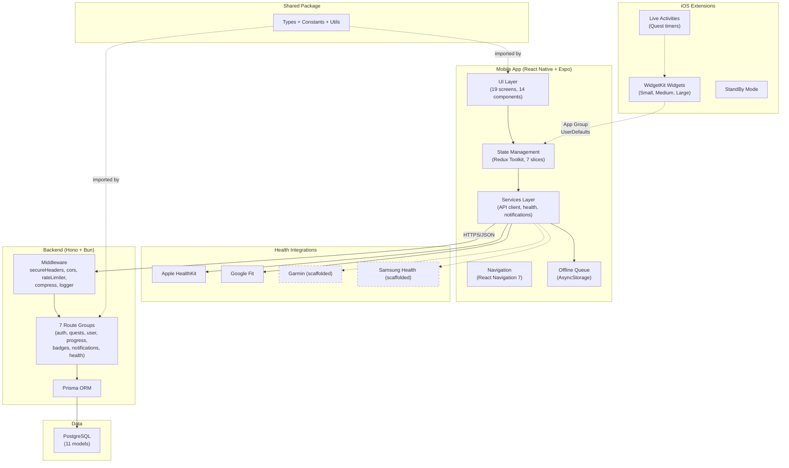

# DYDYD Product Requirements Document

> **Did You Do Your Dailies?** -- A gamified habit tracking app styled as an action-RPG quest system.
>
> **Last updated:** 2026-07-08
> **Status:** Living document. Feature statuses reflect the `main` branch as of the date above.

---

## 1. Overview

### 1.1 Vision and Mission

DYDYD exists to **replace the phone homescreen** with an all-in-one habit and routine builder. The core thesis: adults who struggle with procrastination and scattered routines need a system that makes daily habits feel like quests in a game they want to play -- not a chore list they want to ignore.

The app combines proven engagement patterns from Duolingo (streaks, XP, levels), Finch (compassionate gamification), and The Fabulous (progressive onboarding) with a genuine commitment to meeting users where they are.

### 1.2 Target Users

Adults (18+) who:
- Want to build consistent daily habits but struggle with follow-through
- Respond to gamification (levels, streaks, badges) as a motivation framework
- Use their phone as their primary productivity tool
- Own an iPhone (primary platform) or Android device, with optional Apple Watch

### 1.3 Platform Targets

| Platform | Minimum Version | Status |
|----------|----------------|--------|
| iOS | 16+ | IMPLEMENTED |
| Android | TBD | IMPLEMENTED |
| watchOS | 7+ (Apple Watch Series 4+) | PLANNED |
| iOS Widgets | iOS 16+ (interactive: iOS 17+) | IMPLEMENTED |

### 1.4 Core Value Proposition

**Complete quests. Earn XP. Level up. Build real habits.**

Every daily task becomes a quest with tangible rewards. The gamification loop creates accountability without guilt: compassionate streak design means one bad day does not erase weeks of progress.

---

## 2. Architecture Summary

### 2.1 Tech Stack

| Layer | Technology | Notes |
|-------|-----------|-------|
| Backend | Hono 4 + TypeScript | REST API, Zod validation |
| Runtime | Bun (primary) | `@hono/node-server` fallback for Node.js |
| Database | PostgreSQL + Prisma ORM | 11 models, UUID primary keys |
| Mobile | React Native 0.79 + Expo 53 | Redux Toolkit, React Navigation 7 |
| Shared | TypeScript package (`@dydyd/shared`) | Types, constants, utilities |
| Auth | JWT | 15m access tokens, 7d refresh tokens with rotation |
| CI | GitHub Actions | Test, lint, typecheck, DB validation |
| Monitoring | Sentry | Error tracking on mobile |
| Builds | EAS Build (cloud) | Dev, preview, and production profiles |

### 2.2 Data Model Summary

The Prisma schema defines 11 models:

| Model | Purpose |
|-------|---------|
| `User` | Core user record (email, XP, level, premium status) |
| `UserSettings` | Per-user preferences (notifications, theme, timezone, health sources) |
| `CategoryPriority` | Per-user category priority rankings (1-5) |
| `Quest` | Quest definitions (predefined library + custom quests) |
| `UserQuest` | User-quest relationship (activation, streaks, completion count) |
| `QuestCompletion` | Individual completion records (timestamp, XP, source, value) |
| `Badge` | Badge definitions (name, requirement, rarity, XP bonus) |
| `UserBadge` | User-badge relationship (earned date) |
| `RefreshToken` | JWT refresh token storage (rotation, revocation) |
| `DeviceToken` | Push notification device registration |
| `Notification` | Notification history (type, scheduled/sent/read timestamps) |

### 2.3 System Architecture



> Dashed borders indicate scaffolded services (TypeScript interfaces exist, native modules not installed).

### 2.4 Monorepo Structure

```
apps/
  backend/          # Hono API server (Bun runtime)
  mobile/           # React Native app (iOS + Android)
    widgets/        # WidgetKit Swift code (iOS)
packages/
  shared/           # @dydyd/shared -- types, constants, utilities
specs/              # PRDs, roadmap, issue specs
docs/               # Architecture docs, guides
```

Build order enforced by Turborepo: `shared` must build before `backend` or `mobile`.

---

## 3. Quest System

**Status: IMPLEMENTED**

### 3.1 Quest Categories

Five categories covering all aspects of daily life:

| Category | Icon | Color | Description |
|----------|------|-------|-------------|
| Physical Health | `heart-pulse` | `#EF4444` (Red) | Exercise, sleep, hydration, body care |
| Mental Wellness | `brain` | `#8B5CF6` (Purple) | Meditation, journaling, hobbies, self-care |
| Career & Productivity | `briefcase` | `#3B82F6` (Blue) | Work, learning, networking, personal projects |
| Relationships & Social | `users` | `#F59E0B` (Amber) | Family, friends, social connections |
| Home & Chores | `home` | `#10B981` (Green) | Cleaning, organizing, household tasks |

Each user can set priority rankings (1-5) per category via `CategoryPriority`.

### 3.2 Quest Frequencies

| Frequency | Period Reset | Streak Unit |
|-----------|-------------|-------------|
| Daily | Midnight (user timezone) | Day |
| Weekly | `weeklyResetDay` setting (default Sunday) | Week |
| Monthly | 1st of month | Month |

Completions are tracked per period. A quest with `maxCompletionsPerPeriod: 2` (e.g., "Brush Teeth") can be completed twice per day but not more.

### 3.3 Predefined Quest Library

28 predefined quests across all five categories. All are `isDefault: true` and `isCustom: false`.

**Physical Health (7 quests)**

| Quest | Frequency | Base XP | Max/Period | Health Source | Target |
|-------|-----------|---------|------------|--------------|--------|
| Walk 10,000 Steps | Daily | 10 | 1 | steps | 10,000 steps |
| Drink Water | Daily | 1 | 8 | water_cups | 1 cup |
| Get 8 Hours of Sleep | Daily | 8 | 1 | sleep_hours | 8 hours |
| Exercise Session | Daily | 5 | 2 | workout_minutes | 30 minutes |
| Brush Teeth | Daily | 1 | 2 | -- | -- |
| Take a Shower | Daily | 1 | 1 | -- | -- |
| Eat a Healthy Meal | Daily | 2 | 3 | -- | -- |

**Mental Wellness (5 quests)**

| Quest | Frequency | Base XP | Max/Period | Health Source | Target |
|-------|-----------|---------|------------|--------------|--------|
| Meditate | Daily | 3 | 2 | mindful_minutes | 10 minutes |
| Journal Entry | Daily | 2 | 1 | -- | -- |
| Read for Pleasure | Daily | 2 | 1 | -- | 30 minutes |
| Practice a Hobby | Daily | 2 | 1 | -- | -- |
| Take a Break | Daily | 1 | 3 | -- | -- |

**Career & Productivity (5 quests)**

| Quest | Frequency | Base XP | Max/Period | Health Source | Target |
|-------|-----------|---------|------------|--------------|--------|
| Apply to Jobs | Daily | 1 | 10 | -- | -- |
| Study or Learn | Daily | 2 | 2 | -- | 30 minutes |
| Network | Daily | 2 | 2 | -- | -- |
| Work on Personal Project | Daily | 3 | 2 | -- | -- |
| Complete Online Course Lesson | Weekly | 5 | 5 | -- | -- |

**Relationships & Social (4 quests)**

| Quest | Frequency | Base XP | Max/Period | Health Source | Target |
|-------|-----------|---------|------------|--------------|--------|
| Call or Text a Loved One | Daily | 2 | 3 | -- | -- |
| Quality Time with Family | Daily | 3 | 1 | -- | 60 minutes |
| Social Outing | Daily | 3 | 1 | -- | -- |
| Help Someone | Daily | 2 | 2 | -- | -- |

**Home & Chores (7 quests)**

| Quest | Frequency | Base XP | Max/Period | Health Source | Target |
|-------|-----------|---------|------------|--------------|--------|
| Make Your Bed | Daily | 1 | 1 | -- | -- |
| Do the Dishes | Daily | 1 | 2 | -- | -- |
| Tidy Up | Daily | 1 | 2 | -- | -- |
| Do Laundry | Weekly | 5 | 2 | -- | -- |
| Deep Clean House | Weekly | 10 | 1 | -- | -- |
| Meal Prep | Weekly | 5 | 1 | -- | -- |
| Grocery Shopping | Weekly | 3 | 1 | -- | -- |

### 3.4 Custom Quests

Users can create custom quests within their category of choice.

| Tier | Max Custom Quests | Custom XP Range |
|------|-------------------|----------------|
| Free | 3 | 1-10 XP |
| Premium | 50 | 1-10 XP |

Limits enforced by `APP_CONSTANTS.FREE_CUSTOM_QUESTS` (3) and `APP_CONSTANTS.PREMIUM_CUSTOM_QUESTS` (50).

**User Stories**

> **Given** a free-tier user with 3 existing custom quests
> **When** they attempt to create a 4th custom quest
> **Then** the system returns 400 with a message indicating they have reached the free-tier limit

> **Given** a premium user
> **When** they create a custom quest with name, description, category, frequency, XP (1-10), and max completions
> **Then** the quest is created with `isCustom: true`, `isDefault: false`, and `createdById` set to the user's ID

**Acceptance Criteria**

1. Custom quest creation validates: name (required, non-empty), category (valid enum), frequency (valid enum), baseXP (1-10 integer), maxCompletionsPerPeriod (1+)
2. Free users are blocked at 3 custom quests; premium users at 50
3. Custom quests support optional fields: healthDataType, targetValue, unit, iconName
4. Deleting a custom quest soft-deletes (deactivates) -- completion history is preserved

### 3.5 Quest Activation and Completion Flow

**Activation:**

> **Given** a user browsing the quest library
> **When** they tap "Activate" on a quest
> **Then** a `UserQuest` record is created linking the user to the quest, with `isActive: true` and all streak/completion counters at zero

> **Given** a user who previously deactivated a quest
> **When** they reactivate it
> **Then** the existing `UserQuest` record is updated to `isActive: true` (streak history is preserved)

**Completion:**

> **Given** a user with an active daily quest that has not reached its `maxCompletionsPerPeriod` for today
> **When** they tap "Complete"
> **Then** the system:
> 1. Creates a `QuestCompletion` record with `completedAt`, `xpEarned`, `source`, and `periodStart`
> 2. Increments `UserQuest.totalCompletions` and updates `lastCompletedAt`
> 3. Updates streak counters (`currentStreak`, `longestStreak`)
> 4. Adds `xpEarned` to `User.totalXP`
> 5. Returns the completion details and updated quest state

**Acceptance Criteria**

1. Completion is rejected with 400 if `maxCompletionsPerPeriod` has been reached for the current period
2. Completion is rejected with 404 if the quest is not found or not active for the user
3. XP earned equals `customXP` (if set on UserQuest) or `quest.baseXP`
4. `periodStart` is calculated based on quest frequency: midnight for daily, week start for weekly, month start for monthly
5. Streak is incremented only if no completion exists in the previous period (gap detection)
6. `longestStreak` is updated to `max(longestStreak, currentStreak)` on every completion

**Edge Cases**

- User changes timezone mid-day: completions use the timezone active at completion time
- Quest completed via health sync and manual in same period: both count toward `maxCompletionsPerPeriod`
- Concurrent completion requests: database transaction prevents double-counting XP

### 3.6 Health Data Auto-Completion

> **Given** a user with health data sources configured and active quests linked to health metrics
> **When** the mobile app syncs health data via `POST /api/health/sync`
> **Then** the backend matches each metric against active quests by `healthDataType`, checks `targetValue` thresholds, and auto-completes matching quests that have not reached their period limit

**Supported Health Data Types:**

| Type | Unit | Example Quest |
|------|------|--------------|
| `steps` | steps | Walk 10,000 Steps |
| `distance` | meters | -- |
| `active_calories` | kcal | -- |
| `sleep_hours` | hours | Get 8 Hours of Sleep |
| `water_cups` | cups | Drink Water |
| `workout_minutes` | minutes | Exercise Session |
| `heart_rate` | bpm | -- |
| `mindful_minutes` | minutes | Meditate |
| `stand_hours` | hours | -- |

**Acceptance Criteria**

1. Each metric in the sync payload is validated: `type` must be a known health data type, `value` must be numeric, `source` must be a valid `HealthDataSource`, `timestamp` must be ISO 8601
2. Auto-completion only fires when `metric.value >= quest.targetValue` (if `targetValue` is set)
3. Auto-completed quests respect `maxCompletionsPerPeriod` -- no duplicate completions
4. The `source` field on `QuestCompletion` reflects the health data source (e.g., `apple_health`), not `manual`
5. Total XP earned across all auto-completions is applied in a single user update
6. Response includes: `dataPoints` received, `questsAutoCompleted` (quest IDs), and `xpEarned`

**Edge Cases**

- Health sync arrives with stale data (timestamp from yesterday): completion is attributed to the correct period based on the health data timestamp
- Multiple metrics match the same quest: only the first triggers a completion (period limit check prevents duplicates)
- No matching quests: sync succeeds with `questsAutoCompleted: []` and `xpEarned: 0`

---

## 4. Gamification Engine

### 4.1 XP System

**Status: IMPLEMENTED**

XP (experience points) are the primary currency of progression.

**Constants:**
- `XP_PER_LEVEL_BASE` = 100
- `XP_GROWTH_RATE` = 1.15

**Formula:** XP required for level N = `floor(100 * 1.15^(N-1))`

| Level | XP Required | Cumulative XP |
|-------|-------------|--------------|
| 1 | 100 | 0 |
| 2 | 114 | 100 |
| 5 | 174 | 498 |
| 10 | 351 | 1,675 |
| 20 | 1,423 | 8,813 |
| 50 | 94,231 | 627,518 |
| 100 | 102,114,213 | 680,760,705 |

**XP Sources:**
- Quest completion: `baseXP` (1-10) per quest
- Badge bonus: `xpBonus` (5-2000) per badge earned
- Custom quest XP: user-defined within 1-10 range

**User Stories**

> **Given** a user at level 5 with 549 total XP
> **When** they earn 3 XP from completing a quest
> **Then** their total XP becomes 552, they remain at level 5, and their progress bar shows `(552-549) / 152 = 2%` toward level 6

### 4.2 Level Progression

**Status: IMPLEMENTED**

Levels range from 1 to 100, each with a title that unlocks at specific thresholds:

| Level | Title |
|-------|-------|
| 1 | Novice Adventurer |
| 5 | Apprentice Hero |
| 10 | Journeyman Champion |
| 15 | Skilled Warrior |
| 20 | Expert Achiever |
| 25 | Master of Habits |
| 30 | Grandmaster |
| 40 | Legend |
| 50 | Mythic Hero |
| 75 | Transcendent |
| 100 | Immortal |

The `getLevelTitle()` function returns the highest title the user has earned (a level 12 user sees "Journeyman Champion").

**Acceptance Criteria**

1. Level is computed from total XP using `getLevelFromXP()` -- never stored independently (derived value)
2. Level-up triggers a celebration overlay on the mobile app
3. Level title is displayed on the user profile and progress screens

### 4.3 Badge System

**Status: IMPLEMENTED**

16 predefined badges across four types, with four rarity tiers.

**Badge Types:**

| Type | Requirement Source | Example |
|------|--------------------|---------|
| `STREAK` | Consecutive period completions | "Week Warrior" (7-day streak) |
| `MILESTONE` | Total completions or XP | "First Steps" (1 completion) |
| `CATEGORY` | Category-specific completions | "Health Enthusiast" (100 Physical Health) |
| `SPECIAL` | Custom logic | "Consistency King" (all dailies for 30 days) |

**Rarity Tiers:**

| Rarity | Color | XP Bonus Range | Example |
|--------|-------|---------------|---------|
| Common | -- | 5-50 | First Steps, Week Warrior |
| Rare | -- | 100-200 | Month Master, Consistency King |
| Epic | -- | 500 | Century Club, XP Elite |
| Legendary | -- | 2000 | Year of Dedication |

**Complete Badge List:**

| Badge | Type | Requirement | XP Bonus | Rarity |
|-------|------|-------------|----------|--------|
| First Steps | Milestone | 1 total completion | 5 | Common |
| Week Warrior | Streak | 7-day streak | 25 | Common |
| Month Master | Streak | 30-day streak | 100 | Rare |
| Century Club | Streak | 100-day streak | 500 | Epic |
| Year of Dedication | Streak | 365-day streak | 2000 | Legendary |
| Health Enthusiast | Category | 100 Physical Health completions | 50 | Common |
| Mindful Master | Category | 100 Mental Wellness completions | 50 | Common |
| Career Climber | Category | 100 Career & Productivity completions | 50 | Common |
| Social Butterfly | Category | 100 Relationships & Social completions | 50 | Common |
| Home Hero | Category | 100 Home & Chores completions | 50 | Common |
| Rising Star | Milestone | 1,000 XP | 100 | Common |
| Thousand Club | Milestone | 1,000 XP | 50 | Common |
| XP Elite | Milestone | 10,000 XP | 500 | Epic |
| Early Bird | Special | 7 days of 8+ hours sleep | 25 | Common |
| Hydration Hero | Special | 50 cups of water in a week | 25 | Common |
| Consistency King | Special | All daily quests for 30 days straight | 200 | Rare |

**Badge Evaluation Flow:**

`POST /api/badges/check` evaluates all unearned badges:
1. Loads user stats (XP, completions, streaks, category counts)
2. Filters to badges the user has not yet earned
3. Evaluates each badge's requirement against current stats
4. Awards all newly qualified badges in a single database transaction
5. Adds cumulative `xpBonus` to user's total XP

**User Stories**

> **Given** a user who just completed their 7th consecutive day of quest completions
> **When** badge check runs after the completion
> **Then** they earn the "Week Warrior" badge, receive 25 bonus XP, and see a badge celebration modal

**Edge Cases**

- Badge with `type: 'special'` is skipped during automated evaluation (requires custom logic per badge)
- User earns multiple badges simultaneously: all are awarded in one transaction, XP bonuses stack

### 4.4 Streak Mechanics

#### 4.4.1 Basic Streaks

**Status: IMPLEMENTED**

Streaks track consecutive periods of quest completion. Each `UserQuest` maintains:
- `currentStreak`: consecutive periods with at least one completion
- `longestStreak`: all-time best streak for this quest

The `calculateStreak()` utility walks backward from the current date, checking each period for at least one completion. If a period has no completion, the streak breaks.

A 4-hour grace period (`STREAK_GRACE_PERIOD_HOURS`) past midnight preserves streaks for late-night completions.

**User Stories**

> **Given** a user with a 5-day streak on "Walk 10,000 Steps"
> **When** they complete the quest today
> **Then** their streak becomes 6 days and `longestStreak` updates if 6 exceeds the previous record

> **Given** a user with a 5-day streak who missed yesterday entirely
> **When** they complete a quest today
> **Then** their `currentStreak` resets to 1 (the streak is broken)

#### 4.4.2 Compassionate Streaks

**Status: IN PROGRESS (implemented, pending merge)**

Compassionate streak design ensures the app encourages rather than punishes. Four mechanics work together:

**Streak Freezes** (Duolingo model):
- Users bank streak freezes by maintaining active days (earn 1 freeze every 7 active days)
- Maximum 3 freezes stored (`STREAK_FREEZE_CONFIG.maxFreezes: 3`)
- When a day is missed and freezes are available, one is auto-applied to preserve the streak
- Only one freeze can be used per day
- Freezes are displayed as snowflake/shield icons on the streak display

**Comeback Quests** (re-engagement):
- After missing 1-14 days, the user is offered a special "Welcome Back" quest
- Comeback quests are selected from simple Mental Wellness daily quests
- Bonus XP multiplier of 1.5x (`COMEBACK_CONFIG.bonusXPMultiplier: 1.5`)
- After 14+ days of absence, no comeback quest is offered (user needs a fresh start)
- Completing a comeback quest resets `lastActiveDate` and restarts `activeDaysCount`

**Progressive Onboarding** (The Fabulous model):
- New users start with 3 quest slots (`PROGRESSIVE_ONBOARDING.initialQuestLimit: 3`)
- Every 3 active days, 2 more quest slots unlock (`daysToUnlockMore: 3`, `maxQuestsPerUnlock: 2`)
- After reaching onboarding stage 5 (11+ quest slots), the standard maximum applies (`MAX_ACTIVE_QUESTS: 50`)
- Prevents new-user overwhelm by gradually introducing complexity

**2-Minute Minimum Quest Bars** (Tiny Habits framework):
- Every quest has a minimum bar at 2 minutes (`MINIMUM_QUEST_DURATION_MINUTES: 2`)
- Completion UI shows: "Even 2 minutes of walking counts"
- The 2-minute minimum is always achievable -- "you'd feel silly saying no"
- Backend accepts `durationMinutes` on completion; if >= 2 but below full target, records `minimumBar: true`

**User Stories**

> **Given** a user who missed yesterday but has 2 streak freezes available
> **When** they open the app today
> **Then** a freeze is auto-applied, their streak is preserved, and freeze count drops to 1

> **Given** a user who has been absent for 3 days
> **When** they open the app
> **Then** they see a "Welcome Back" card with a comeback quest offering 1.5x XP

> **Given** a brand-new user on their first day
> **When** they try to activate a second quest
> **Then** they see "Complete 3 more active days to unlock additional quests"

**Acceptance Criteria**

1. Streak freeze auto-applies without user intervention when a missed day is detected
2. Streak calculation treats freeze days as streak-continuing (not a break)
3. Freeze count increments by 1 (up to max 3) every 7 active days
4. Comeback quest appears only for 1-7 day absences; not for 8+ days
5. Comeback XP = `floor(baseXP * 1.5)`
6. Progressive onboarding enforces: `maxActiveQuests = 1 + (onboardingStage * 2)`
7. Onboarding limit is removed at stage 5+
8. 2-minute minimum completions are recorded as valid completions

**Open Questions**

- **Minimum-bar XP credit (requires FOUNDER sign-off):** Should completing the 2-minute minimum earn full XP or partial XP (e.g., 50%)? Options:
  - **Full credit:** Aligns with compassionate design -- never make the user feel they failed. Finch model.
  - **Partial credit (50%):** Creates incentive to do the full quest. Duolingo model.
  - **Recommendation:** Full credit for MVP with a configurable `MINIMUM_BAR_XP_MULTIPLIER` backend constant. A/B test partial credit once baseline retention data exists.

**Edge Cases**

- User has exactly 0 freezes and misses a day: streak resets normally
- User uses a freeze, then completes a quest later that same day: both the freeze and the completion count (no conflict)
- New user reaches stage 5 on day 15: progressive limit silently removed, no UI disruption
- Re-engagement notifications never use punitive language ("You broke your streak", "You failed", "Don't lose your progress")

---

## 5. Health Integration

### 5.1 Apple HealthKit

**Status: IMPLEMENTED (iOS)**

Integration via `react-native-health`. The mobile app reads aggregated health metrics from HealthKit and sends summaries to the backend for auto-completion.

**Supported Data Types:** steps, distance, active calories, sleep hours, workout minutes, heart rate, mindful minutes, stand hours

**Privacy:** Raw health records are never sent to the server. Only aggregated metrics (e.g., "10,432 steps today") are transmitted. This complies with Apple's HealthKit data usage guidelines.

### 5.2 Google Fit / Health Connect

**Status: IMPLEMENTED (Android)**

Integration via platform API. Same data flow as HealthKit -- aggregated metrics sent to backend.

**Supported Data Types:** steps, distance, active calories

### 5.3 Garmin Connect

**Status: SCAFFOLDED (not functional)**

TypeScript service interface exists in `apps/mobile/src/services/wearables/`. NativeModules references are present but native modules are not installed or bridged.

### 5.4 Samsung Health

**Status: SCAFFOLDED (not functional)**

Same as Garmin -- TypeScript scaffold only. Targets Wear OS and Tizen platforms.

### 5.5 Apple Watch HealthKit Auto-Logging

**Status: PLANNED (Phase 4A M2)**

When the Apple Watch companion ships, the Watch will use `HKObserverQuery` for background delivery of steps, workouts, and sleep. When health data meets a quest's `targetValue`, the Watch sends a `QUEST_COMPLETED` message to the phone with `source: apple_health`.

**User Stories**

> **Given** a user wearing an Apple Watch with HealthKit permissions granted
> **When** they walk 10,000 steps during the day (tracked by the Watch)
> **Then** the "Walk 10,000 Steps" quest auto-completes without any manual input from either the Watch or phone app

**Edge Cases**

- Watch and phone both have step data: Watch data takes priority (more accurate real-time tracking)
- Auto-completion respects `maxCompletionsPerPeriod` -- no duplicate completions from Watch + phone
- HealthKit background delivery is system-managed (not polling) to preserve battery

---

## 6. iOS Widgets

**Status: IMPLEMENTED (Phase 4A M1 -- PR #82 merged)**

Interactive home screen widgets built with WidgetKit and Swift, managed via Expo config plugin for CNG compatibility.

### 6.1 Architecture

**Data Flow:**

1. React Native app writes `WidgetData` JSON to App Group `UserDefaults` (key: `widgetData`)
2. Widget extension reads from `UserDefaults(suiteName: "group.com.dydyd.app")`
3. `TimelineProvider` refreshes every 15 minutes
4. Interactive check buttons use iOS 17 `AppIntent` to write `PendingCompletion` to UserDefaults
5. When the main app foregrounds, it reads and processes pending completions via existing Redux thunks

**Files:**

- Config plugin: `apps/mobile/plugins/withDYDYDWidgets.js`
- Swift source: `apps/mobile/widgets/` (WidgetBundle, TimelineProvider, Small/Medium/Large views, AppIntent, LiveActivity, ColorExtension)
- RN service: `apps/mobile/src/services/widgetData.ts`

### 6.2 Small Widget (Daily XP Ring)

Displays: circular XP progress ring (`dailyXP / dailyGoal`), streak count with flame icon, current level number.

**Acceptance Criteria**

1. XP ring color matches design system category colors
2. Placeholder text "Open DYDYD to get started" when no data is available
3. Tapping deep-links to HomeScreen via `dydyd://home`
4. Renders correctly on all iPhone sizes (SE through Pro Max)

### 6.3 Medium Widget (Top 3 Quests)

Displays: top 3 uncompleted quests with name, icon, XP value, and interactive check button.

**Acceptance Criteria**

1. Check buttons work via `AppIntent` (iOS 17+); on iOS 16, tapping opens the app
2. Completed quests show checkmark overlay and dimmed styling
3. Fewer than 3 remaining quests: "All done for today!" in empty slots
4. Quest order: category priority, then XP descending

### 6.4 Large Widget (Full Dashboard)

Displays: XP progress ring, streak count, top 5 quests with check buttons, completed/total count, level and level title, today's date, and progress summary line.

**Acceptance Criteria**

1. Interactive check buttons function identically to medium widget
2. Widget updates immediately after completion (timeline reload)
3. Dark mode support via `@Environment(\.colorScheme)`
4. Visual design uses app's color palette

### 6.5 StandBy Mode

Small and medium widgets render in StandBy Mode (iOS 17+) when iPhone is in landscape charging orientation.

**Acceptance Criteria**

1. Renders with high-contrast colors suitable for nightstand distance viewing
2. Verified on physical device in landscape orientation

### 6.6 Live Activities (Quest Timer)

When a user starts a timed quest (e.g., "Meditate 10 minutes"), a Dynamic Island / Lock Screen Live Activity shows elapsed time and progress ring.

**Acceptance Criteria**

1. Live Activity uses `ActivityKit` framework
2. Auto-dismisses when timer completes or quest is marked done
3. Falls back to Lock Screen display on devices without Dynamic Island

**Edge Cases**

- Force-quit app, complete quest via widget, re-open: pending completion is processed from UserDefaults
- Widget timeline refresh limits: 15-minute interval plus completion-triggered reloads stay within system limits
- App Group data size: only top 5 quests with essential fields (not full `UserQuest` objects)

---

## 7. Apple Watch Companion

**Status: PLANNED (Phase 4A M2 -- Issue #81, not started)**

### 7.1 WatchConnectivity Bridge

The `watchConnectivityService.ts` is currently scaffolded with `NativeModules` references. Implementation will use `react-native-watch-connectivity` via EAS Build bare workflow.

**Message Types:**

| Type | Direction | Transport | Purpose |
|------|-----------|-----------|---------|
| `SYNC_QUESTS` | Phone -> Watch | `updateApplicationContext` | Send active quests |
| `QUEST_COMPLETED` | Watch -> Phone | `sendMessage` / `transferUserInfo` | Notify of completion |
| `SYNC_PROGRESS` | Phone -> Watch | `updateApplicationContext` | Send progress data |
| `REQUEST_SYNC` | Watch -> Phone | `sendMessage` | Request fresh data |
| `UPDATE_COMPLICATIONS` | Phone -> Watch | `updateApplicationContext` | Refresh complications |

**Acceptance Criteria**

1. `updateApplicationContext` used for background sync (survives disconnect)
2. `sendMessage` used for real-time interactions when phone is reachable
3. Graceful degradation: if Watch is not paired/reachable, all sends return `false` silently

### 7.2 Quest Completion from Watch

SwiftUI Watch app displays today's active quests in a `List` view with "Complete" buttons.

**Acceptance Criteria**

1. Quest list matches phone's active quests (synced via application context)
2. Completion sends `QUEST_COMPLETED` via `sendMessage` (reachable) or `transferUserInfo` (offline)
3. Works offline with last-synced data
4. Completed quests show checkmark and dimmed styling
5. Pull-to-refresh sends `REQUEST_SYNC`

### 7.3 Complications

| Family | Content |
|--------|---------|
| Graphic Circular | Daily XP progress ring with streak count center |
| Graphic Corner | Streak count with flame icon |
| Modular Small | Streak count number |

Complications update on `UPDATE_COMPLICATIONS` message and every 15 minutes (background refresh, max 4/hour per Apple guidelines).

### 7.4 Haptic Reminders

- Watch registers local notifications at `UserQuest.reminderTime`
- Haptic pattern: `WKInterfaceDevice.current().play(.notification)` -- gentle single tap
- Respects `notificationsEnabled` and `hapticFeedbackEnabled` settings
- Re-scheduled whenever quest data syncs from phone

### 7.5 HealthKit Auto-Logging from Watch

- Background delivery via `HKObserverQuery` for steps, workouts, sleep, mindful minutes, active energy
- Auto-completion when metric meets quest `targetValue`
- Phone-side dispatches existing `completeQuest` thunk with `source: HealthDataSource.APPLE_HEALTH`
- Respects `maxCompletionsPerPeriod`

**Edge Cases**

- Phone in airplane mode: completion queued via `transferUserInfo`, syncs on reconnect
- Watch app is standalone-lite: works with last-synced data but requires phone for backend sync
- Battery: `HKObserverQuery` is system-managed (not polling); complications limited to 4 refreshes/hour

---

## 8. History and Analytics

### 8.1 TimeBucket Enum

**Status: PLANNED (Phase 4A M4)**

| Bucket | Hours | Associated Badge (Phase 5) |
|--------|-------|---------------------------|
| EARLY_MORNING | 4am - 7am | Dawn Patrol |
| MORNING | 7am - 12pm | Early Bird |
| AFTERNOON | 12pm - 5pm | Afternoon Adventurer |
| EVENING | 5pm - 9pm | -- |
| NIGHT | 9pm - 4am | Night Owl |

**Steady Eddie** badge (Phase 5): same bucket for the same quest, 7+ consecutive completions.

### 8.2 Silent Completion Logging

Every quest completion will silently record a `timeBucket` field on the `QuestCompletion` record. The bucket is computed from the completion timestamp in the user's configured timezone -- never from UTC.

**User Stories**

> **Given** a user completes a quest at 8:30am local time
> **When** the completion is recorded
> **Then** `timeBucket` is set to `MORNING` automatically, with no user input required

**Acceptance Criteria**

1. `getTimeBucket(timestamp, timezone)` utility converts any timestamp to the correct bucket in the user's timezone
2. Backend auto-populates `timeBucket` on every `QuestCompletion` -- no client input required
3. Health sync auto-completions use the health data timestamp (not the sync timestamp) for bucket calculation
4. `timeBucket` field is nullable in Prisma (backward-compatible with existing completions)

**Edge Cases**

- Timezone changes: bucket is calculated in the user's current timezone at completion time
- A user in UTC+9 completes at 6am local (9pm UTC previous day): bucket is `EARLY_MORNING`, not `NIGHT`

### 8.3 Weekly Digest Modal

**Status: PLANNED**

> **Given** a new week begins
> **When** the user opens the app for the first time on or after Monday (or their `weeklyResetDay`)
> **Then** they see a modal with: total completions, XP earned, streak status, and week-over-week comparison

**Acceptance Criteria**

1. Shows absolute change and percentage: "12 quests, up from 9 last week (+33%)"
2. Honest reporting of dips: "7 quests, down from 12 last week (-42%)" -- no consolation language
3. First-week users see absolute stats only: "Your first week! Here's how it went:"
4. Shown once per week; flag persisted in AsyncStorage (`lastWeeklyDigestShown`)
5. "Dismiss" and "View Details" (navigates to Progress screen) buttons
6. Data sourced from `GET /api/progress/weekly` (extended with previous-week comparison fields)

### 8.4 Completion History List

**Status: PLANNED**

Chronological list of recent completions on the Progress screen.

**Acceptance Criteria**

1. Each item shows: quest name, category color dot, time bucket label, relative time, XP earned
2. Paginated (20 items/page) with infinite scroll
3. Sourced from new `GET /api/progress/history?page=1&perPage=20` endpoint
4. Tappable items navigate to quest detail screen
5. Empty state: "No completions yet -- complete your first quest to start tracking!"

### 8.5 Analytics Dashboard (Future -- Phase 5)

Full analytics dashboard with: completion heat map, per-category trends, health metric overlays, personal records, week-over-week comparisons. 7-day and 30-day views with category color coding.

### 8.6 Time-of-Day Badges (Future -- Phase 5)

Badges based on completion timing patterns:
- **Early Bird:** 5+ morning completions in a row
- **Night Owl:** 5+ evening/night completions in a row
- **Steady Eddie:** Same time bucket for 7+ consecutive days
- **Dawn Patrol:** Complete all dailies before 9am for 5 days

---

## 9. Notifications

### 9.1 Push Notifications

**Status: IMPLEMENTED (client-side scheduling)**

The notification system has two layers:

1. **Local scheduling (implemented):** `NotificationsService` on mobile uses `expo-notifications` to schedule quest reminders locally. Registers Expo push token with backend via `POST /api/notifications/device-token`.

2. **Server-side push (not yet implemented):** Backend stores device tokens and notification records but has no dispatch endpoint. The `Notification` model tracks `scheduledFor`, `sentAt`, and `readAt` in preparation.

### 9.2 Daily Reminders

Users can set a `dailyReminderTime` (HH:mm format) in settings. The mobile app schedules a local notification at that time daily.

### 9.3 Streak Warning Notifications

**Status: PLANNED (part of Compassionate Streaks)**

When a user has streak freezes available and has not completed any quests by a configurable time, a notification mentions the freeze option: "Your [quest name] streak is at risk -- want to use a freeze?"

### 9.4 Achievement Notifications

Badge earned and level up events trigger local celebration overlays (implemented). Push notification for these events is planned for server-side push.

### 9.5 Weekly Reset Notifications

**Status: PLANNED**

Notification on `weeklyResetDay` summarizing the week. Ties into the Weekly Digest feature (Section 8.3).

### 9.6 Gentle Re-engagement Notifications

**Status: PLANNED (part of Compassionate Streaks)**

**Tone Rules:**
- Always compassionate: "We missed you! Here's a quick quest to get back on track"
- Never punitive: never "You broke your streak" or "You failed" or "Don't lose your progress"
- Schedule: 24h inactivity, then 48h, then 72h, then stop (no spam)
- If freezes available, the 24h notification mentions the freeze option
- Users can opt out via `gentleRemindersEnabled` toggle (defaults to `true`)

---

## 10. User Management

### 10.1 Authentication

**Status: IMPLEMENTED**

JWT-based authentication with token rotation.

| Token | Lifetime | Secret |
|-------|----------|--------|
| Access token | 15 minutes | `JWT_SECRET` |
| Refresh token | 7 days | `JWT_REFRESH_SECRET` |

**Flows:**
- **Register:** Email + password + displayName. Password hashed with bcrypt (12 rounds). Creates User + UserSettings. Returns token pair.
- **Login:** Email + password. Returns token pair.
- **Refresh:** Old refresh token is revoked, new pair issued (rotation prevents replay).
- **Logout:** Revokes refresh token(s) for the user.
- **Forgot Password:** Generates a hashed reset token stored in RefreshToken table with `password_reset:` prefix.
- **Reset Password:** Validates reset token, updates password hash, revokes all sessions.

**Password Requirements:**
- Minimum 8 characters
- At least one uppercase letter, one lowercase letter, one digit

### 10.2 User Profile

**Status: IMPLEMENTED**

User profile includes: `displayName`, `avatarUrl` (optional), `totalXP`, `level`, `isPremium`, `premiumExpiresAt`, `settings`, `categoryPriorities`.

Updatable fields: `displayName`, `avatarUrl`.

### 10.3 Settings

**Status: IMPLEMENTED**

| Setting | Type | Default |
|---------|------|---------|
| `notificationsEnabled` | boolean | `true` |
| `dailyReminderTime` | string (HH:mm) | `null` |
| `weeklyResetDay` | integer (0-6) | `0` (Sunday) |
| `timezone` | string | `"UTC"` |
| `healthDataSources` | string[] | `[]` |
| `theme` | `light` / `dark` / `system` | `"system"` |
| `soundEnabled` | boolean | `true` |
| `hapticFeedbackEnabled` | boolean | `true` |

### 10.4 Account Deletion

**Status: IMPLEMENTED**

`DELETE /api/user/account` requires password confirmation. Cascading delete removes all user data: settings, quests, completions, badges, tokens, notifications, category priorities.

**User Stories**

> **Given** a user who wants to delete their account
> **When** they confirm with their password on the Settings screen
> **Then** all their data is permanently deleted and they are logged out

### 10.5 Onboarding Flow

**Status: IMPLEMENTED**

`RootNavigator` conditionally renders `AuthNavigator`, `OnboardingNavigator`, or `MainTabNavigator` based on auth and onboarding state.

The onboarding flow introduces the quest system, lets the user select initial categories, and activates their first quest.

---

## 11. Social Features (Future -- Phase 5+)

**Status: NOT STARTED**

Placeholder for future social engagement features:

- **Leaderboards:** Already partially implemented (`GET /api/progress/leaderboard` exists with weekly and all-time modes). Full social leaderboard with friend filtering is Phase 5+.
- **Friend Challenges:** Head-to-head quest challenges with friends
- **Accountability Partners:** Paired users who can see each other's streaks and send encouragement
- **Shared Quests:** Quests that multiple users complete together

---

## 12. Premium / Monetization (Future)

**Status: FEATURE-FLAGGED (launch as free)**

The `User.isPremium` and `premiumExpiresAt` fields exist in the schema. Premium will be feature-flagged at launch -- all users get the free tier. Premium monetization is a post-launch decision.

| Feature | Free | Premium |
|---------|------|---------|
| Custom quests | 3 max | 50 max |
| Predefined quest library | Full access | Full access |
| Health integrations | Full access | Full access |
| Widgets | Full access | Full access |
| Advanced analytics | -- | Phase 5+ |
| Priority support | -- | Phase 5+ |

---

## Appendix A: Glossary

| Term | Definition |
|------|-----------|
| **Quest** | A habit or task definition with name, category, frequency, XP value, and optional health data source |
| **UserQuest** | A user's activation of a Quest, tracking their streaks, completion count, and custom settings |
| **QuestCompletion** | A single record of completing a quest, with timestamp, XP earned, source, and period context |
| **Badge** | An achievement awarded for reaching specific milestones (streaks, completions, XP thresholds) |
| **XP** | Experience points -- the primary progression currency, earned from quest completions and badge bonuses |
| **Streak** | Consecutive periods (days/weeks/months) with at least one completion of a given quest |
| **Freeze** | A streak freeze (planned) that preserves a streak through one missed day, earned by maintaining active days |
| **Comeback Quest** | A special "Welcome Back" quest offered to users returning after 1-14 days of absence, with 1.5x XP bonus |
| **TimeBucket** | A time-of-day classification (planned) -- EARLY_MORNING, MORNING, AFTERNOON, EVENING, NIGHT -- recorded on each completion |
| **Period** | The time window for a quest's frequency: one day (daily), one week (weekly), or one month (monthly) |
| **Level Title** | A narrative title (e.g., "Novice Adventurer", "Mythic Hero") that unlocks at specific level thresholds |

---

## Appendix B: API Surface Summary

**Base URL:** `http://localhost:3000`
**Auth:** Bearer token in `Authorization` header
**Rate Limit:** 100 requests per 15-minute window per IP on all `/api/*` routes

| Method | Path | Auth | Description |
|--------|------|------|-------------|
| `GET` | `/health` | None | Health check (status, timestamp, environment) |
| | | | |
| | **Auth** | | |
| `POST` | `/api/auth/register` | None | Register new user with email, password, displayName |
| `POST` | `/api/auth/login` | None | Login with email and password, returns JWT pair |
| `POST` | `/api/auth/refresh-token` | None | Rotate refresh token, issue new access + refresh tokens |
| `POST` | `/api/auth/logout` | Required | Revoke one or all refresh tokens for the user |
| `POST` | `/api/auth/forgot-password` | None | Generate password reset token |
| `POST` | `/api/auth/reset-password` | None | Reset password using reset token, revokes all sessions |
| | | | |
| | **Quests** | | |
| `GET` | `/api/quests/library` | Optional | List all predefined (default) quests |
| `GET` | `/api/quests/user` | Required | List user's active quests with today's completions |
| `POST` | `/api/quests/activate` | Required | Activate a quest for the user |
| `POST` | `/api/quests/:id/complete` | Required | Complete a quest; validates period limits, awards XP |
| `DELETE` | `/api/quests/:id` | Required | Deactivate a user quest (soft delete) |
| `POST` | `/api/quests/custom` | Required | Create a custom quest (free: max 3, premium: max 50) |
| | | | |
| | **User** | | |
| `GET` | `/api/user/profile` | Required | Get user profile with settings and category priorities |
| `PUT` | `/api/user/profile` | Required | Update displayName and/or avatarUrl |
| `GET` | `/api/user/settings` | Required | Get user settings |
| `PUT` | `/api/user/settings` | Required | Update user settings |
| `GET` | `/api/user/category-priorities` | Required | Get category priority rankings |
| `PUT` | `/api/user/category-priorities` | Required | Replace all category priorities |
| `DELETE` | `/api/user/account` | Required | Delete account and all data (requires password) |
| | | | |
| | **Progress** | | |
| `GET` | `/api/progress/stats` | Required | Get overall user stats (XP, level, streaks, badges) |
| `GET` | `/api/progress/daily` | Required | Daily progress with category breakdown |
| `GET` | `/api/progress/weekly` | Required | 7-day weekly progress |
| `GET` | `/api/progress/badges` | Required | User's earned badges ordered by date |
| `GET` | `/api/progress/leaderboard` | Required | Leaderboard (weekly or all-time) |
| | | | |
| | **Badges** | | |
| `GET` | `/api/badges` | Optional | List all badge definitions |
| `GET` | `/api/badges/user` | Required | List user's earned badges |
| `POST` | `/api/badges/check` | Required | Evaluate and award newly earned badges |
| | | | |
| | **Notifications** | | |
| `POST` | `/api/notifications/device-token` | Required | Register/upsert device push token |
| `GET` | `/api/notifications` | Required | Notification history (paginated) |
| `PUT` | `/api/notifications/:id/read` | Required | Mark notification as read |
| | | | |
| | **Health** | | |
| `POST` | `/api/health/sync` | Required | Sync health metrics, auto-complete matching quests |

**Total: 32 endpoints** (1 health check + 31 API routes)

**Response Envelope:**

All responses use the `ApiResponse<T>` format:

```json
// Success
{
  "success": true,
  "data": { ... },
  "meta": { "page": 1, "perPage": 20, "total": 150, "hasMore": true }
}

// Error
{
  "success": false,
  "error": {
    "code": "VALIDATION_ERROR",
    "message": "Validation failed",
    "details": { "email": ["Please provide a valid email"] }
  }
}
```

**Error Codes:**

| Code | HTTP Status | Description |
|------|------------|-------------|
| `BAD_REQUEST` | 400 | Invalid request parameters |
| `UNAUTHORIZED` | 401 | Missing or invalid auth token |
| `FORBIDDEN` | 403 | Insufficient permissions |
| `NOT_FOUND` | 404 | Resource not found |
| `CONFLICT` | 409 | Duplicate resource (e.g., email already registered) |
| `VALIDATION_ERROR` | 422 | Zod schema validation failure |
| `TOO_MANY_REQUESTS` | 429 | Rate limit exceeded |
| `INTERNAL_ERROR` | 500 | Unexpected server error |

---

*This document is maintained by the PRODUCT agent and reflects the state of the DYDYD codebase on the date listed at the top. Feature statuses (IMPLEMENTED, IN PROGRESS, PLANNED, SCAFFOLDED) are determined by what exists on the `main` branch, not by roadmap intent.*
